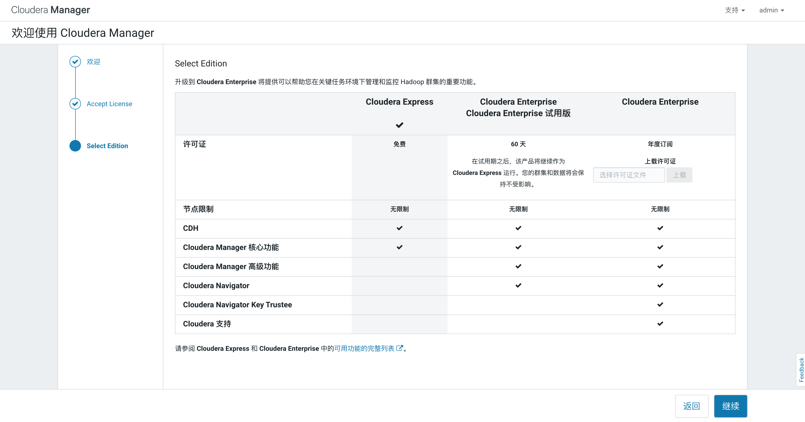
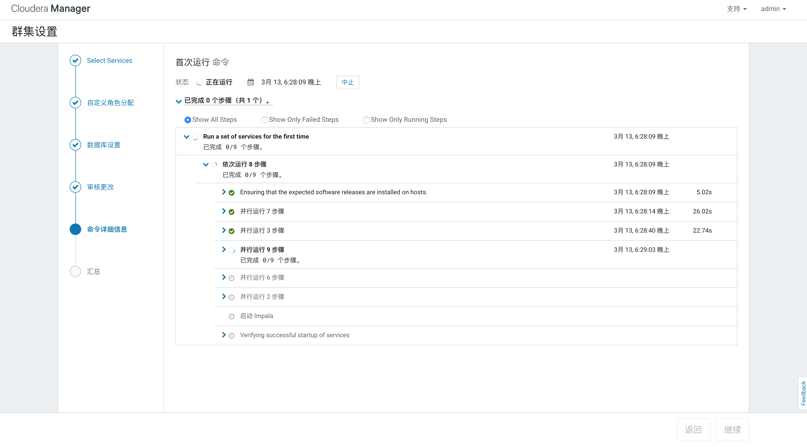

# Cloudera 介绍与配置

## 1. Cloudera 介绍

### 1.1 Cloudera 简单概念

CDH 是一个可用于机器学习，分析，并且针对类似云产品进行大量优化的一个现代化平台。实际上就是可以将维护整个 hadoop 生态圈，只提供一个平台管理页面，即可一键完成部署，启动，关闭，整个集群中的某一个服务。

### 1.2 Cloudera 适用场景

- 数据仓库：
- 数据科学
- 数据工程
- 企业级大数据解决方案

## 2. CDH 介绍

### 2.1 CDH 简单概念

CDH 是一个以 Apache Hadoop 为核心的，成熟稳定的项目，整合了 Hadoop 生态圈。其中包括 Hive，Hbase，Sentry，Impala，Kudu，Spark等

## 3. Cloudera Manager 介绍

### 3.1 Cloudera Manager 简单概念

Cloudera Manager 是一个用于管理 CDH 集群的终端产品。通过 Cloudera Manager 可以非常简单且集中部署 CDH 集群当中的每一个服务。应用会自动安装并配置，节省整个部署和维护时间。同时还提供了 web 操作界面，可以直接配置整个集群信息

### 3.2 Cloudera Manager 中的一些术语介绍

这里只做一些简单介绍，一些术语我自己也不是特别理解，写多了反而容易写错，这里就简单的描述一下自我理解，不一定完全正确

- **deployment** - Cloudera Manager 用于管理集群的配置
- **dynamic resource pool** - 
- **cluster** - 集群，通常来讲是指一群安装部署了 hadoop 的机器，但是在 Cloudera Manager 里，是指安装了 CDH 服务的机器。每一台机器只能属于一个 CDH 集群，但是 Cloudera Manager 可以同时管理多个 CDH 集群
- **host** - 物理机或者虚拟机，一台 host 只能属于一个 CDH 集群
- **rack** - 在 Cloudera Manager 中，指的是物理上，连接在同一台交换机上的服务器
- **service** - 一般是指 CDH 集群中的服务，比如 Spark 服务，Hive 服务，Impala 服务等
- **service instance** - 服务实例
- **role** - 角色，一般是指服务内的角色，比如对于 hadoop 服务内，有两个角色，一个是 namenode 角色，一个是 datanode 角色
- **role instance** - 角色实例，可以想像成运行该角色的进程
- **host template** - 
- **gateway** - 一种角色类型，一般是用来提供对外服务。一般来讲，像 Hive，Hadoop，Spark 这些服务都会有自己的对外服务接口，方便外部客户端调用。而 gateway 可以想成将这些所有对外接口整合在一起，统一管理，部署有 gateway 的服务器，一般称呼为 gateway node
- **parcel** - 一些以二进制格式分布式存储的文件，一般保存着编译过的代码，包的版本，描述，依赖等元信息
- **static service pool** - Cloudera Manager 管理的整个集群当中的 CPU，内存，I/O 等信息

### 3.3 Cloudera Manager 基本结构组织

如下图所示，整个 Cloudera Manager 的核心是 Cloudera Manager Server，该 Server 提供了对外的 Admin Console Web 服务。同时还负责 Hadoop 生态圈中的其它服务的安装，配置，启动和关闭等


具体组件介绍：

- Agent：在集群当中的每台 host 上都有安装，该服务负责在每台机器中启动关闭进程(其它服务进程)，解压配置，触发安装，并且监控当前 host 的运行状态
- Management Service：由许多不同角色组成的一个服务，用于提供监视，报警服务
- Database：保存配置，监控信息。通常来讲，逻辑上的数据库是运行在不同的数据库服务器上的。
- Cloudera Repository：存储 Cloudera Manager 用于分发到各个 host 上所需要的包
- Clients：对外提供服务
  1. Admin Console：Cloudera Manager 提供的web端管理服务
  2. API：开发人员可以通过 API 建立定制版的 Cloudera Manager 应用

默认情况下，Agent 服务每 15s 就会向 Cloudera Manager Server 发送一次心跳检查

### 3.4 State Management

Cloudera Manager 会维护所有 cluster 的 state。state 可以被分为两个大类：model 和 runtime。二者都会保存在 Cloudera Manager Server Database 里。

Models 是指每个服务里的角色，配置，依赖信息等，定义哪些机器跑哪些服务的哪些角色

Runtime State 是指具体有哪些命令正在执行

### 3.5 Configuration Management

Cloudera Manager 针对配置定义了多个级别：

- **The Service Level** - Service Level 级别的配置主要应用与服务实例上，比如 HDFS 的 replication 配置（dfs.replication）
- **The role group level** - 该配置主要应用于服务中的具体角色实例上，比如 HDFS 服务中的 DataNode 角色，可以单独配置 handler count (dfs.datanode.handler.count)
- role group level 的配置会覆盖从 Service level 继承下来的相同配置，所以配置的时候要注意这一点
- hosts 会拥有一些与环境有关的配置，比如监视器配置等
- Cloudera Manager 自己本身的配置的管理与维护由自己本身提供，不在此处

### 3.6 Process Management

在非 Cloudera Manager 环境下，启动一个服务一般使用服务自己的启动脚本，或者使用系统配置好的脚本，比如 service hadoop-hdfs-datanode start，但是在 Cloudera Manager 环境下，该命令是不起作用的。

用户只能通过 Cloudera Manager 来启动和关闭服务。Cloudera Manager 使用开源的 Process Management 服务：supervisord。该服务负责启动关闭进程，监控输出日志，报告错误等。同时针对失败的进程 Cloudera Manager 也会尝试重新启动

停止 Cloudera Manager Server 和 Cloudera Manager Client 服务并不会关闭正在跑的其它服务，其它正在运行的进程将继续运行下去。

Cloudera Manager Agent 服务是通过 init.d 启动的，当它启动之后，就会去与 Cloudera Manager 进行联系，然后来决定接下来需要启动哪些服务。Agent 服务也会被 Cloudera Mangager Monitor 进行监视，一旦 Agent 服务挂掉，那么当前这台 host 会被标记为非健康状态。

Agent 负责启动和关闭新的进程，通过与 Cloudera Manager Client 的 heartbeat 沟通，一旦获取到了新的 process 启动请求，agent 会创建本地目录 /var/run/cloudera-scm-agent 并且解压获取到的配置信息，然后通知 supervisord 服务去启动新的进程

### 3.7 Software Distribution Management

Cloudera Manager 最主要的任务就是安装和升级 CDH 集群当中的服务。Cloudera Manager 支持两种软件分发格式(software distribution formats)：packages 和 percels

Packages（包） 是一个二进制包，包含了已经编译好的代码，和一些包的版本，依赖等信息。Package Management System 会评估这些信息，并允许这些包自行查找和升级到最新的版本，并且会自动下载完整依赖。Cloudera Manager 一般使用本地自带的包管理系统(native system package manager)，各个系统有各自不同的包管理工具。（比如 yum 和 apt-get）

Parcel 也是一个二进制分发格式，但是会多保存一些元信息用于 Cloudera Manager 管理

二者具体区别：

- Parcel 是独立安装到版本目录下的，意味着可以在一台机器上安装多个不同版本的 Parcel，在使用的时候会指定使用版本即可。当然在安装包的时候，同一时间只会有一个包被安装，所以无需担心具体是哪个包被安装了，哪个被激活了
- Parcel 支持滚动升级（rolling upgrade），在升级的时候，不会打断整体服务，整个服务会分别升级
- 你可以将 Parcel 安装在系统里的任意目录下，默认安装目录为 /opt/cloudera/parcels，与之相对的，package 服务默认安装在 /usr/lib 目录下
- 如果你从 Parcel 页面安装 Parcel 服务，Cloudera Manager 会自动下载，分发，然后激活正确 parcel。逻辑上属于同一个集群的 host 必须拥有相同的操作系统

基于上述特性，Parcels 相比 Packages 拥有如下优点：

- **Distribution of CDH as a single object** - 大概意思应该是，只需要下载一次，然后将这一个包分发到集群里的机器上，即使有些机器不能联网也能升级。而 packages 虽然每台机器都有安装，但都要下载升级包
- **Internal consistency** - 所有 CDH 组件都是版本匹配的，不会下载到不同 CDH 版本里的组件。这里的意思因该是 Parcels 会保存当前的 CDH 版本信息，保证所下载的所有组件都是符合当前版本。使用 packages 因该是不会考虑当前 CDH 版本的，需要手动维护下载源，否则版本可能会下错。
- **Installation outside of /usr** - 在某些情况下，给 hadoop 集群服务分配的用户角色不一定有权限调用系统的 pacakge 服务去安装包。但是 parcels 可以。
  > 注意：对于 parcels，CDH 的 libraries 目录为：/opt/cloudera/parcels/CDH/lib 而不是 /usr/lib。并且请不要将 /usr/lib 目录与 parcels 的部署目录 link 起来，这会导致一些错误。
- **Installation of CDH without sudo** - 不需要 root 权限也可以安装 CDH 环境
- **Decoupled distribution from activation** - 与实际运行过程解耦，在下载升级前，不会对现有运行的服务造成影响。
- **Rolling upgrades** - 滚动升级，如果使用 packages，意味着你必须要先关闭旧的进程，然后才能进行升级，并且一旦升级出现错误，将很难恢复。使用 parcels 升级，升级将会是循序渐进的，中途无需关闭服务。大版本升级需要重新启动服务。
- **Upgrade Management** - 使用 parcels，Cloudera Manager 可以控制整个升级流程。使用 pacakges，Cloudera Manager 只能触发升级启动
- **Additional component** - parcels 不仅仅适用于 CDH。
- **Compatibility with other distribution tools** - 

### 3.8 Host Management

Cloudera Manager 提供了许多特性用来维护 Hadoop 集群。当你第一次安装 Cloudera Manager 并登陆 Admin Console，你可以搜索当前网络下的 host，然后把它加入到你的 cluster 当中。一旦你选择的 host 被分配了 CDH 服务，Cloudera Manager 会自动帮你去安装所有需要的软件和依赖的包，比如：JDK，Cloudera Manager Agent，Impala，Solr等等

一旦服务被部署成功并开始运转，那么你可以在 Admin Console 查看到 host 的整个运行状态。

### 3.9 Resource Management

资源管理通过定义不同服务对集群资源的影响来帮助确保可预测的行为，主要功能为：

- 针对要求较为苛刻的工作，确保在合理的时间内完成
- 基于每组资源的公平分配，支持在用户组之间进行合理的集群调度
- 防止用户剥夺其他用户访问群集的权限。

主要功能是资源分配，具体内容这里不详细介绍了

### 3.10 User Management

对于 Cloudera Manager 的登陆功能主要由 User Accounts 负责，一个 user account 决定了这个用户的认证，以及所拥有的权限。具体情况这里不做描述了，具体见官方文档。

### 3.11 Security Management

Cloudera Manager 致力于整合多个项目的安全配置，这里也不做过多描述，具体见官方文档。

### 3.12 Cloudera Manager Service

The Cloudera Manager Service 包含了多个组件用来管理整个集群，这些组件被划分为多个角色：

- **Activity Monitor** - 收集有关被 MapReduce 调用的服务信息。默认情况下不会添加该角色
- **Host Monitor** - 收集并衡量有关 host 的健康信息
- **Service Monitor** - 收集并衡量有关 service，yarn 和 impala 启动的服务的健康信息。
- **Event Server** - 收集整理有关 hadoop 事件的信息，使这些信息可以被审计检索。
- **Alert Publisher** - 针对某些事件提供报警功能
- **Reports Manager** - 生成报告，以提供有关用户，用户组和目录的磁盘利用率，用户和YARN池以及HBase表和名称空间处理活动的历史视图。Cloudera Express 中未添加此角色。

#### 3.12.1 Health Test

Cloudera Manager monitor 会监控所有 service，role 的健康状态，并且反馈到 web 页面当中。Cloudera Manager 同时还会提供健康检测，健康检测会将被检测的对象的健康状况分为几个等级。角色健康检测默认为开启状态。一个比较简单的检测例子：检测是否有足够的磁盘空间用于使用

#### 3.12.2 Metric Collection and Display

#### 3.12.3 Events, Alerts, and Triggers

### 4. 服务器环境配置

服务器环境：

| host | 系统 | cloudera 服务 | hadoop 角色 |
| ---- | --- | ------------ | ----------- |
|  master  | CentOS-7-x86_64-Minimal-1908.iso | server | namenode |
|  slave1  | CentOS-7-x86_64-Minimal-1908.iso | agent | datanode |
|  slave2  | CentOS-7-x86_64-Minimal-1908.iso | agent | datanode |

三台服务器全都是 基础版本的 CentOS 7，intel CPU，并且可以连接外网

> CDH 环境对系统是有要求的，具体可以查看官方的文档，至少 64 位操作系统，ext4 文件系统是必须的

#### 4.1 配置免密登陆（所有节点）

服务器基础环境配置都是以 root 用户来进行操作的

- **检查安装 ssh 服务**

首先要确保自己的机器安装 ssh 服务，如果没有请使用 yum 安装
minimal version 安装之后自动带有 ssh 服务，并且开启了远程 ssh 登陆，所以下面的安装命令只是一个示例

``` bash
yum -y install openssh-server openssh-clients
```

- **修改 ssh 服务配置**

然后修改 sshd 配置，配置文件：/etc/ssh/sshd_config，将文件中的 PermitRootLogin，RSAAuthentication，PubkeyAuthentication 三个配置打开

> 这里我没有修改我的配置，在我的配置文件当中并没有找到 RSAAuthentication 这个属性，其它两个配置虽然都处于被注释掉的情况，但是我还是将我的免密登陆配置成功了，之后也没有去调查具体原因，但是这里有必要将该过程进行记录下来，以便之后使用

``` bash
PermitRootLogin yes
RSAAuthentication yes
PubkeyAuthentication yes
```

- **生成 RSA 密钥对**

``` bash
# 该命令默认使用 RSA 加密方式，想使用其它加密方式请 man ssh-keygen 查看说明
ssh-keygen
```

直接执行上述命令行，然后一直回车直到结束，如果需要指定特殊的 RSA namespace，请在生成过程中自己配置，具体请参考其它文章

- **生成密钥对之后将公钥复制到另外两台服务器当中**

生成的密钥对处于 ～/.ssh 目录下，～是当前用户的根目录，由于我们使用的是 root 用户，所以是 /root/.ssh。在该目录下，会生成两个文件，如果在生成密钥对的时候没有进行 namespace 的配置，那么默认是 id_rsa (保存私钥) 和 id_rsa.pub (保存公钥)

在之前的 sshd_config 配置文件当中有如下配置，这个文件是用来保存其它服务器的 PubKey 的

``` bash
AuthorizedKeysFile      .ssh/authorized_keys
```

也就是和密钥对同一个目录下，检查发现并没有 authorized_keys 这个文件，很简单，我们使用 vi 命令新建一个同名文件，然后使用 cat 命令查看一下其它两个机器的 id_rsa.pub 文件，将里面的内容分别复制在新建的这个文件里，保存之后，公钥就配置结束了。三台电脑分别要保存另外两台电脑的公钥。

- **启动或重启 ssh 服务**

``` bash
service sshd start/restart
```

#### 4.2 关闭 SELinux （所有节点）

一开始我是没有关闭这个服务的，但是之后安装 mysql 的时候出现了一些奇怪的问题
首次查看一下 selinux mode，如果是 Permissive 或者 Disabled，则可以跳过该步骤

``` bash
getenforce
```

如果是 enforcing，则需要临时关闭

``` bash
setenforce 0
```

如果需要永久关闭，则需要修改配置文件：/etc/selinux/config

``` bash
# This file controls the state of SELinux on the system.
# SELINUX= can take one of these three values:
#     enforcing - SELinux security policy is enforced.
#     permissive - SELinux prints warnings instead of enforcing.
#     disabled - No SELinux policy is loaded.
SELINUX=disabled # 这一行修改成 permissive 或者 disabled
# SELINUXTYPE= can take one of three values:
#     targeted - Targeted processes are protected,
#     minimum - Modification of targeted policy. Only selected processes are protected.
#     mls - Multi Level Security protection.
SELINUXTYPE=targeted
```

修改之后，重启电脑即可生效 \
Cloudera 文档中说安装完成之后即可将该服务再重新启动，不过具体情况之后在分析

#### 4.3 关闭防火墙（所有节点）

在关闭之前我尝试不关闭防火墙进行安装操作，但是后续步骤有太多端口需要配置处理，所以最终还是决定关闭防火墙（Cloudera Manager 文档也要求先关闭防火墙，或者针对所有服务的端口都进行配置）

``` bash
# 关闭防火墙
service firewalld stop
# 关闭防火墙开机启动
systemctl disable firewalld
```

#### 4.4 安装配置 ntp 服务（所有节点）

CDH 服务默认是使用 ntp 来进行时间同步。
CentOS 7 默认是使用 chrony 服务来同步时间，如果有安装 chrony 服务，CDH 会优先选择 chrony 服务，即使在安装了 ntp 的前提下。不过 ntp 推介使用 ntp 服务。

- **检查是否有 chrony 服务，有则关闭或者删除**

``` bash
yum remove chrony
```

- **安装 ntp 服务（所有节点）**

``` bash
yum -y install ntp
```

- **修改 ntp 配置**

正常来讲应该将整个集群的一个机器作为 所有机器的 ntp 上游服务器，然后该 ntp 服务器的上游为其它。

修改主节点 ntp 配置文件：/etc/ntp.conf

``` bash
# 设置 ip-address 为下游 ntp 服务器ip，将 mask 设置为 255.255.255.255 说明指定了唯一IP，
# 这里可以根据 mask 将前面的 ip 变为一个网段，这样就完成了整个网段的配置，这里我只有两台下游，所以直接使用 ip 指定
restrict 下游IP1 mask 255.255.255.255 nomodify notrap
restrict 下游IP2 mask 255.255.255.255 nomodify notrap

# 注释掉原来的 server 开头的一系列配置
server ntp1.aliyun.com prefer
server ntp2.aliyun.com
server ntp3.aliyun.com
server ntp4.aliyun.com
server ntp5.aliyun.com
server ntp6.aliyun.com
server ntp7.aliyun.com
```

配置下游 ntp 配置：/etc/ntp.conf

``` bash
server 主节点IP prefer
```

- **启动 ntp 服务**

``` bash
# 启动服务
service ntpd start
# 设置为开机启动
systemctl enable ntpd.service
```

#### 4.5 安装 java （所有节点）

Cloudera Manager 要求 Java 必须安装到 /usr/java 目录下 \
并且最新且经过测试的 Java 版本为：1.8u181

> 注意：由于 Java 指定了版本，所以不能使用 yum 直接进行下载，需要手动下载指定的包进行安装

- **解压 jdk**

``` bash
tar -zxvf /opt/jdk-8u181-linux-x64.tar.gz -C /usr/java/
```

- **配置环境变量**

``` bash
# 编辑
vim /etc/profile
```

在 profile 末尾添加

``` bash
# JAVA HOME
export JAVA_HOME=/usr/java/jdk1.8.0_181

# PATH
export PATH=$JAVA_HOME/bin:$PATH
```

保存后 source

``` bash
source /etc/profile
```

测试一下

``` bash
java -version
```

显示如下

``` bash
java version "1.8.0_181"
Java(TM) SE Runtime Environment (build 1.8.0_181-b13)
Java HotSpot(TM) 64-Bit Server VM (build 25.181-b13, mixed mode)
```

#### 4.6 安装 mysql（只需要一个）

mysql 只需要安装在 master 节点作为之后的 metadata database \
经过 Cloudrea 验证的最新版本为：5.7

经过反复安装（然后再删除）之后，建议使用 yum 安装 mysql，手动直接解压的免安装的 tar 包，还需要配置很多东西才能启动 mysql，工作量比较大，所以建议使用 yum 安装

- **安装 mysql yum 源** （所有节点）

mysql 的 yum 源建议在所有节点都配置，之后使用 yum 安装 Cloudera Manager 服务的时候，会下载有关 mysql 的依赖，为了保证所下载的依赖和安装的 mysql 版本完全对应，请务必在各个节点都配置mysql 的 yum 源，并且把版本都设置为一样的。

在安装前需要先删除 CentOS 自带的 mariadb

``` bash
yum -y remove mariadb-libs
```

根据官方文档，需要手动安装 mysql 的 yum 源 \
下载地址：https://dev.mysql.com/downloads/repo/yum/ \
下载完成之后安装 yum 源

``` bash
rpm -Uvh mysql80-community-release-el7-3.noarch.rpm
```

> 这里看起来像是安装了一个 mysql 8.x 版本的 yum 源，实际上是包含所有 mysql 版本的 yum 源，只不过最新版本更新到了 mysql 8.x

- **配置 yum 安装的 mysql 版本**

首先看一看 mysql repo 是否安装成功

``` bash
yum repolist | grep mysql
```

结果为：

``` bash
mysql-connectors-community/x86_64       MySQL Connectors Community           141
mysql-tools-community/x86_64            MySQL Tools Community                105
mysql80-community/x86_64                MySQL 8.0 Community Server           161
```

安装成功了，但是版本是 mysql 8.0 版本，也就是说如果现在使用 yum 安装mysql，一定是安装的最新版本，所以我们需要修改一下 yum 配置来指定我们的版本

- **修改 repo 配置，配置 mysql 版本为 5.7**

修改文件：/etc/yum.repos.d/mysql-community.repo \
找到如下代码

``` bash
[mysql57-community]
name=MySQL 5.7 Community Server
baseurl=http://repo.mysql.com/yum/mysql-5.7-community/el/7/$basearch/
enabled=1 # 这里之前是0，现在修改为1
gpgcheck=1
gpgkey=file:///etc/pki/rpm-gpg/RPM-GPG-KEY-mysql

[mysql80-community]
name=MySQL 8.0 Community Server
baseurl=http://repo.mysql.com/yum/mysql-8.0-community/el/7/$basearch/
enabled=0 # 这里之前是1，现在修改为0
gpgcheck=1
gpgkey=file:///etc/pki/rpm-gpg/RPM-GPG-KEY-mysql
```

修改完成之后，再次调用 yum repolist | grep mysql 即可发现 mysql 版本已经更换。mysql yum 源安装成功。

- **安装 mysql**

 Cloudera 官网有说明对于 Mysql 5.7 版本需要安装 shared-compat 或者 shared 包，用于安装 Cloudra Manager Agent 服务。根据调查，shared 包就是 mysql-commnutiy-libs 包，所以最终需要安装的服务如下

``` bash
yum install mysql-community-{server,client,common,libs}-*
```

等待完整及安装结束

- **启动 mysql**

``` bash
service mysqld start
```

- **初始化 root 密码并配置远程登陆**

启动之后，mysql 5.7 版本会给 root 用户分配一个临时密码，这个密码需要在 /var/log/mysqld.log 文件中搜索 temporary password 找到，找到之后使用临时密码登陆，登陆之后第一件事就是修改 root 密码，不修改密码 mysql 也不会允许你干其它事情。

``` sql
set password=PASSWORD('your_new_password');
```

修改完成后，配置 root 用户远程登陆

``` sql
use mysql;
update user set password=PASSWORD('your_new_password') where user='root';
GRANT ALL PRIVILEGES ON *.* TO 'root'@'%' IDENTIFIED BY 'password' WITH GRANT OPTION;
flush privileges;
```

### 5. 安装 Cloudera Manager

上述环境配置完成之后，正式开始安装 CDH 环境，但是在安装 CDH 之前，首先要安装 Cloudera Manager，使用 Cloudera Manager 来安装 CDH

手动安装 Cloudera Manager 还需要配置一些用户和目录，操作比较繁琐，所以我们使用官方文档描述的 yum 的方式来安装 Cloudera Manager 6.2.1 版本，但是 rpm 包特别大，直接用 yum 来下载反而会特别慢，所以做一个折中选择。配置 yum 源，但是 rpm 包自己下载，然后使用 yum 安装本地 rpm 包，用 yum 帮我们解决依赖问题。

#### 5.1 安装 yum 源（所有节点）

- **下载 yum 源**

从官网下载 Cloudera Manager yum 源 \
官方文档：https://docs.cloudera.com/documentation/enterprise/6/release-notes/topics/rg_cm_6_version_download.html \

官方举例
``` bash
wget <repo_file_url> -P /etc/yum.repos.d/
```

由于我们没有 wget 命令，所以也没安装，我使用自己电脑下载了 repo 文件然后scp到这个目录下 \
repo 文件：cloudera-manager.repo

可以打开这个文件简单看一下内容

``` bash
[cloudera-manager]
name=Cloudera Manager 6.2.1
baseurl=https://archive.cloudera.com/cm6/6.2.1/redhat7/yum/
gpgkey=https://archive.cloudera.com/cm6/6.2.1/redhat7/yum/RPM-GPG-KEY-cloudera
gpgcheck=1
enabled=1
autorefresh=0
```

看来只能下载 6.2.1 了，不能像 mysql 那样随心所欲配置版本，怪不得官方每个版本都提供一个 repo 文件

- **导入 GPG Key**

比 mysql 多一步，应该是用来认证的

``` bash
rpm --import https://archive.cloudera.com/cm6/6.2.1/redhat7/yum/RPM-GPG-KEY-cloudera
```

> 注意：官方文档给的是 6.x 的文档，里面举的例子是 6.0.0 的，所以我们不能直接复制给出的 url，我们实际需要的 url 其实在我上面提到的官方文档网址里有给出，按照自己的需求找到即可

#### 5.2 安装 Cloudera Manager RPM 包

根据最一开始的 Clouderam Manager 整体介绍，我们至少要完成以下工作：

1. 主 Cloudera Manager 节点安装 server，agent 服务
2. 所有从节点 安装 agent 服务
3. 配置 mysql 数据库，配置 Cloudera Manager 的数据库配置
4. 启动 server 服务，启动所有 agent 服务

- **下载 RPM 包**

一共有三个包需要安装：cloudera-manager-server，cloudera-manager-agent，cloudera-manager-demons，所以下载三个 rpm 包即可

官方下载地址：https://archive.cloudera.com/cm6/6.2.1/redhat7/yum/RPMS/x86_64/

- **yum 安装服务**

主节点需要安装全部三个包

``` bash
yum -y install cloudera-manager-daemons-6.2.1-1426065.el7.x86_64.rpm cloudera-manager-agent-6.2.1-1426065.el7.x86_64.rpm cloudera-manager-server-6.2.1-1426065.el7.x86_64.rpm
```

从节点不需要安装 server

``` bash
yum -y install cloudera-manager-daemons-6.2.1-1426065.el7.x86_64.rpm cloudera-manager-agent-6.2.1-1426065.el7.x86_64.rpm
```

查看已经安装好的包

``` bash
yum list installed | grep cloudera
```

安装完成

#### 5.3 配置 mysql

在安装完成之后还不能直接启动，需要配置 mysql 数据库，这一步其实可以在安装好 mysql 服务后直接进行配置。不过该步骤其实不完全属于环境配置，毕竟环境配置与 CDH 无关，所以我分割到这里来写。

- **修改 mysql 配置**

  Cloudera Manager 官方文档针对 mysql 有做以下几点要求

  - 为了防止死锁，设置隔离级别（isolation level）为 READ-COMMITTED
  - 配置 InnoDB 引擎，如果使用 MyISAM 引擎，Cloudera Manager 将会启动失败，并且如果没有配置 InnoDB，那么默认会使用 MyISAM（好像现在默认都是 InnoDB 引擎了，不过官方文档这么写了，我还是按照官方文档的进行一下配置）
  - 大多数 mysql 默认设置的缓存大小（buffer size）和内存使用率（memory usage）都比较保守稳定，但是 Cloudera Manager 会进行大量的写入操作，所以建议将 innodb_flush_method 配置为 O_DIRECT
  - 最大连接数（max_connections）属性取决于集群的规模：
    - 如果小于 50 台机器，你可以将所有的 database 都建立在同一台 host 里
      - 最好每个数据库都物理隔离
      - 每一个数据库都应该分配 100 个连接数，并 添加 50 个额外连接数。举个例子，假设在单个 mysql 服务器需要建立两个 database，则最大连接数应该设置为 250。如果要建立五个 database（Cloudera Manager Server, Activity Monitor, Reports Manager, Cloudera Navigator, and Hive metastore）那么应该设置为 550
    - 超过 50 台机器，请不要将数据库都建立在一个数据库服务器里，至少不是同一个 host，
  - 如果集群规模超过 1000 台机器，设置 max_allowed_packet 为 16M，否则集群将会启动失败并抛出以下异常：com.mysql.jdbc.PacketTooBigException
  - 二进制日志（Binary logging）记录对于 Cloudera Manager 的安装不是必需的，按自己需求配置即可

官方推介配置：

``` ini
[mysqld]
datadir=/var/lib/mysql
socket=/var/lib/mysql/mysql.sock
transaction-isolation = READ-COMMITTED
# Disabling symbolic-links is recommended to prevent assorted security risks;
# to do so, uncomment this line:
symbolic-links = 0

key_buffer_size = 32M
max_allowed_packet = 32M
thread_stack = 256K
thread_cache_size = 64
query_cache_limit = 8M
query_cache_size = 64M
query_cache_type = 1

max_connections = 550
#expire_logs_days = 10
#max_binlog_size = 100M

#log_bin should be on a disk with enough free space.
#Replace '/var/lib/mysql/mysql_binary_log' with an appropriate path for your
#system and chown the specified folder to the mysql user.
log_bin=/var/lib/mysql/mysql_binary_log

#In later versions of MySQL, if you enable the binary log and do not set
#a server_id, MySQL will not start. The server_id must be unique within
#the replicating group.
server_id=1

binlog_format = mixed

read_buffer_size = 2M
read_rnd_buffer_size = 16M
sort_buffer_size = 8M
join_buffer_size = 8M

# InnoDB settings
innodb_file_per_table = 1
innodb_flush_log_at_trx_commit  = 2
innodb_log_buffer_size = 64M
innodb_buffer_pool_size = 4G
innodb_thread_concurrency = 8
innodb_flush_method = O_DIRECT
innodb_log_file_size = 512M

[mysqld_safe]
log-error=/var/log/mysqld.log
pid-file=/var/run/mysqld/mysqld.pid

sql_mode=STRICT_ALL_TABLES
```

根据上述配置文档，我们暂时不弃用二进制日志，所以不配置 log_bin, server_id, binlog_format 这三个配置。另外 sql_mode 在 5.7 版本默认为 STRICT_TRANS_TABLES，所以也不配置了，剩下的都按照上述文档来

最终修改结果为：

``` ini
# For advice on how to change settings please see
# http://dev.mysql.com/doc/refman/5.7/en/server-configuration-defaults.html

[mysqld]
#
# Remove leading # and set to the amount of RAM for the most important data
# cache in MySQL. Start at 70% of total RAM for dedicated server, else 10%.
# innodb_buffer_pool_size = 128M
#
# Remove leading # to turn on a very important data integrity option: logging
# changes to the binary log between backups.
# log_bin
#
# Remove leading # to set options mainly useful for reporting servers.
# The server defaults are faster for transactions and fast SELECTs.
# Adjust sizes as needed, experiment to find the optimal values.
# join_buffer_size = 128M
# sort_buffer_size = 2M
# read_rnd_buffer_size = 2M
datadir=/var/lib/mysql
socket=/var/lib/mysql/mysql.sock
transaction-isolation = READ-COMMITTED

# Disabling symbolic-links is recommended to prevent assorted security risks
symbolic-links=0

key_buffer_size = 32M
max_allowed_packet = 32M
thread_stack = 256K
thread_cache_size = 64
query_cache_limit = 8M
query_cache_size = 64M
query_cache_type = 1

max_connections = 550

read_buffer_size = 2M
read_rnd_buffer_size = 16M
sort_buffer_size = 8M
join_buffer_size = 8M

# InnoDB settings
innodb_file_per_table = 1
innodb_flush_log_at_trx_commit  = 2
innodb_log_buffer_size = 64M
innodb_buffer_pool_size = 4G
innodb_thread_concurrency = 8
innodb_flush_method = O_DIRECT
innodb_log_file_size = 512M

log-error=/var/log/mysqld.log
pid-file=/var/run/mysqld/mysqld.pid
```

保存退出，重启数据库

- **安装 JDBC 驱动** （所有节点）

直接调用 yum install mysql-connector-java 其实就可以下载了，而且由于我们之前已经配置了 mysql 的 yum 源，下载的应该是符合版本要求的包，但是我在下载过程当中看到了依赖 openjdk，所以感到有些迷惑，因为我使用的 java 是 Oracle Java，并且是手动安装的，为了防止不必要的安装，这里选择手动安装 JDBC 驱动，官方文档也提供了手动安装的步骤。

下载 JDBC 驱动：https://dev.mysql.com/downloads/connector/j/

直接进入这个网址看到的是 8.x 的版本，点一下 **Looking for previous GA versions?** 连接，跳到之前的版本下载界面，Cloudera Manager 官方文档里使用的是 5.1.46，我这里下载的是 5.1.48

解压 tar 包

``` bash
tar -zxvf mysql-connector-java-5.1.48.tar.gz
```

进入解压出来的目录里，复制 bin.jar 结尾的文件到 /usr/share/java 目录下，如果没有这个目录则手动建立，重命名 jar 文件为：mysql-connector-java.jar

``` bash
# 建立目录
mkdir -p /usr/share/java/
# 进入解压出来的目录
cd mysql-connector-java-5.1.48
# 复制并重命名 jar 包
cp mysql-connector-java-5.1.48-bin.jar /usr/share/java/mysql-connector-java.jar
```

最后将此 jar 包放到其它节点的相同目录下即可

- **创建 Cloudera Manager 和 CDH 需要的数据库 user 和 database**

| Service | Database | User |
| ------- | -------- | ---- |
| Cloudera Manager Server | scm | scm |
| Activity Monitor | amon | amon |
| Reports Manager | rman | rman |
| Hue | hue | hue |
| Hive Metastore Server | metastore | hive |
| Sentry Server | sentry | sentry |
| Cloudera Navigator Audit Server | nav | nav |
| Cloudera Navigator Metadata Server | navms | navms |
| Oozie | oozie | oozie |

``` sql
CREATE DATABASE scm DEFAULT CHARACTER SET utf8 DEFAULT COLLATE utf8_general_ci;
GRANT ALL ON scm.* TO 'scm'@'%' IDENTIFIED BY '1qaz@WSX';

CREATE DATABASE amon DEFAULT CHARACTER SET utf8 DEFAULT COLLATE utf8_general_ci;
GRANT ALL ON amon.* TO 'amon'@'%' IDENTIFIED BY '1qaz@WSX';

CREATE DATABASE rman DEFAULT CHARACTER SET utf8 DEFAULT COLLATE utf8_general_ci;
GRANT ALL ON rman.* TO 'rman'@'%' IDENTIFIED BY '1qaz@WSX';

CREATE DATABASE hue DEFAULT CHARACTER SET utf8 DEFAULT COLLATE utf8_general_ci;
GRANT ALL ON hue.* TO 'hue'@'%' IDENTIFIED BY '1qaz@WSX';

CREATE DATABASE metastore DEFAULT CHARACTER SET utf8 DEFAULT COLLATE utf8_general_ci;
GRANT ALL ON metastore.* TO 'hive'@'%' IDENTIFIED BY '1qaz@WSX';

CREATE DATABASE sentry DEFAULT CHARACTER SET utf8 DEFAULT COLLATE utf8_general_ci;
GRANT ALL ON sentry.* TO 'sentry'@'%' IDENTIFIED BY '1qaz@WSX';

CREATE DATABASE nav DEFAULT CHARACTER SET utf8 DEFAULT COLLATE utf8_general_ci;
GRANT ALL ON nav.* TO 'nav'@'%' IDENTIFIED BY '1qaz@WSX';

CREATE DATABASE navms DEFAULT CHARACTER SET utf8 DEFAULT COLLATE utf8_general_ci;
GRANT ALL ON navms.* TO 'navms'@'%' IDENTIFIED BY '1qaz@WSX';

CREATE DATABASE oozie DEFAULT CHARACTER SET utf8 DEFAULT COLLATE utf8_general_ci;
GRANT ALL ON oozie.* TO 'oozie'@'%' IDENTIFIED BY '1qaz@WSX';
```

- **初始化数据库**

之前安装的 Cloudera Manager Server 里自带了一个初始化数据库的脚本 \
目录：/opt/cloudera/cm/schema/scm_prepare_database.sh

这个脚本会完成一下 server 的初始化配置，虽然里面也会帮忙创建数据库，但是还是建议在前面手动创建

执行脚本：

``` bash
# mysql 是数据库类型，scm 是 Cloudera Manager Server 需要的数据库名称，还有用户名
./scm_prepare_database.sh mysql scm scm
```

结果：

``` bash
Enter SCM password: 
JAVA_HOME=/usr/java/jdk1.8.0_181
Verifying that we can write to /etc/cloudera-scm-server
Creating SCM configuration file in /etc/cloudera-scm-server
Executing:  /usr/java/jdk1.8.0_181/bin/java -cp /usr/share/java/mysql-connector-java.jar:/usr/share/java/oracle-connector-java.jar:/usr/share/java/postgresql-connector-java.jar:/opt/cloudera/cm/schema/../lib/* com.cloudera.enterprise.dbutil.DbCommandExecutor /etc/cloudera-scm-server/db.properties com.cloudera.cmf.db.
Fri Mar 13 17:14:44 CST 2020 WARN: Establishing SSL connection without server's identity verification is not recommended. According to MySQL 5.5.45+, 5.6.26+ and 5.7.6+ requirements SSL connection must be established by default if explicit option isn't set. For compliance with existing applications not using SSL the verifyServerCertificate property is set to 'false'. You need either to explicitly disable SSL by setting useSSL=false, or set useSSL=true and provide truststore for server certificate verification.
[                          main] DbCommandExecutor              INFO  Successfully connected to database.
All done, your SCM database is configured correctly!
```

- **删除内嵌的 PostgreSQL 配置文件**（不一定需要）

如果上述脚本执行成功，则删除内嵌的配置文件

``` bash
rm /etc/cloudera-scm-server/db.mgmt.properties
```

> **注意，这一步我并没有执行，因为我在这个目下没有找到这个配置文件，唯一一个配置文件打开后发现里面配置的我的 mysql 数据库，并且注释有写该文件是被之前执行的 scm_prepare_database.sh 脚本生成的，所以这里我只是将官方文档复制了过来，并不需要执行。**

#### 5.4 配置 CDH parcel 包

在启动 Cloudera Manager 后，我们会在 web 页面进行 CDH 的安装操作，但是安装 CDH 需要 CDH 的 parcel 包，这个包非常大，所以建议我们提前下载

CDH 6.2.1 版本的下载地址：https://archive.cloudera.com/cdh6/6.2.1/parcels/

我们一共需要下载四个文件：

- **CDH-6.2.1-1.cdh6.2.1.p0.1425774-el7.parcel** - 必须下载，这个文件是 CDH 的安装包，里面基本包含了所有的服务，比如 hadoop，hive，impala 等等，大约 2G。
- **CDH-6.2.1-1.cdh6.2.1.p0.1425774-el7.parcel.sha1** - 必须下载，其实这个文件可以手动生成，如果你下载下来打开看，其实是一个 hash 值，这个值在 manifest.json 文件里有记录，所以我们可以手动创建这个文件，然后把 manifest.json 里记录的 hash 值复制进去。
- **CDH-6.2.1-1.cdh6.2.1.p0.1425774-el7.parcel.sha256** - 非必须，这个记录了 sha256 的值，应该是方便我们自己做完整性校验的，我下载下来也是为了校验一下 CDH parcel 文件完整性，手动计算了一下 sha256 的值，确定文件完整。
- **manifest.json** - 必须下载，保存了所有包的信息。

最终我们真正需要的只有三个文件：CDH-6.2.1-1.cdh6.2.1.p0.1425774-el7.parcel，CDH-6.2.1-1.cdh6.2.1.p0.1425774-el7.parcel.sha1，manifest.json

这三个文件需要放到 parcel 的 repo 目录下：/opt/cloudera/parcel-repo

这里需要注意，CDH-6.2.1-1.cdh6.2.1.p0.1425774-el7.parcel.sha1 这个文件必须重命名将后面的数字1去掉，否则 Cloudera Manager 识别不到，会重新下载 CDH 包

``` bash
mv CDH-6.2.1-1.cdh6.2.1.p0.1425774-el7.parcel.sha1 CDH-6.2.1-1.cdh6.2.1.p0.1425774-el7.parcel.sha
```

至此，我们已经完成了所有的配置工作，可以启动 Cloudera Manager 服务并安装 CDH 了。

### 6. 启动 Cloudera Manager 并安装 CDH

#### 6.1 启动 Cloudera Manager Server

``` bash
systemctl start cloudera-scm-server
```

启动需要一段时间，可以在 /var/log/cloudera-scm-server 目录下查看日志

``` bash
tail -f /var/log/cloudera-scm-server/cloudera-scm-server.log
```

当看到如下日志，即表示启动成功

``` log
2020-03-13 17:50:57,925 INFO WebServerImpl:org.eclipse.jetty.server.Server: Started @52848ms
2020-03-13 17:50:57,925 INFO WebServerImpl:com.cloudera.server.cmf.WebServerImpl: Started Jetty server.
```

可以登陆 http://<server_host>:7180 进入 Cloudera Manager 界面

#### 6.2 登陆 Cloudera Manager Admin Console

- **登陆**

  默认用户名和密码为：admin/admin


- **欢迎界面，继续**


- **接受 License 后选择安装版本**

  这里选择 Cloudera Express 版本


#### 6.3 集群安装

- **集群安装 welcome 界面**


- **一路下一步，走到指定 hosts界面**

  在这个界面，需要搜索整个网络中你需要加入到集群当中的服务器，包括 Cloudera Manager Server 本身


- **选择存储库，也就是 repo**

  这里我们选择 Public Cloudera Repository，因为我们已经下好了 parcel 包，所以不会被重复下载，自定义库需要进行搭建才行，剩下的选择默认配置


- **安装 JDK**

  我们已经安装了 JDK，这里无需再次安装，不打勾点击继续


- **提供 SSH 登陆凭证**


- **安装 Agents**

  一旦进入这一步，Cloudera Manager 会自动对你刚刚指定的所有 host 安装 Cloudera Manager Agent 服务。由于我们在之前就已经手动安装过了此服务，所以这一步将会很快结束。也就是说，实际上我们只需要在主节点安装 daemons 和 server 包就行，剩下的 agent 包在这一步会帮我们安装。不过前面的步骤顺手就安装了，如果集群多达几百个，前面确实可以省去每个节点安装 agent 包的步骤，交给这里负责安装。


- **安装 Parcels**

  这里少截了一张图，在安装完成 agents 之后，会自动走到这一步，然后自动开始安装 CDH 的 parcel。由于我们已经将 parcel 包下载到指定的 parcel-repo 目录下，所以会直接跳过下载步骤，直接进行安装。

- **安装完成**

  选择第二个进入集群配置


#### 6.4 集群设置

- **选择需要安装的服务**

  我全都要。。。


- **按需分配各个服务的角色**


- **数据库设置**


- **审核更改**

  忘记截图了，这个界面用于配置一些集群信息，比如 HDFS 块大小，NameNode  数据目录，DataNode 数据目录等等，我这里直接保持默认值不变进行下一步。

- **自动开始运行**


- **完成**


#### 6.5 效果图


官方文档：https://docs.cloudera.com/documentation/enterprise/6/6.2/topics/installation.html
