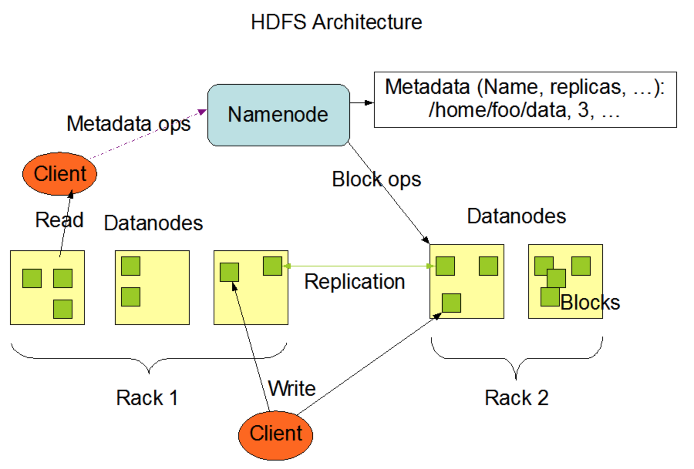
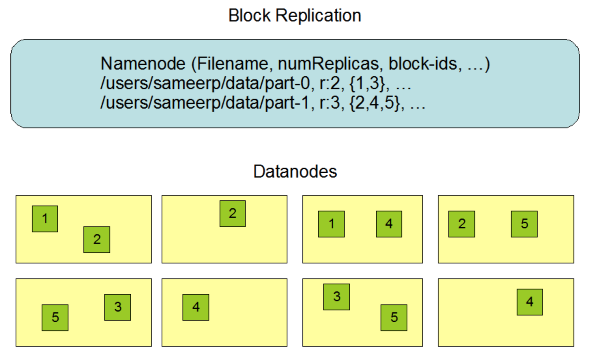

# HADOOP 介绍与配置

## 1. Hadoop 简单理解

Hadoop 是 Apache 基金会的一个分布式开源框架，由 Java 编写。Hadoop 使集群中的机器彼此协同工作，分布式完成存储或处理大数据。

直接从概念上并不好理解 Hadoop 具体能干什么，最好的方式是理解其内部组成。

### 1.1 Hadoop 最初组成

- **Hadoop Distributed File System (HDFS)** - 分布式文件系统。类似通常使用的操作系统一样，内部包含一个自己的本地的文件系统。分布式文件系统如字面意思所说，是一个将一个集群，分布式部署的多个服务器，看作一个庞大的整体，提供了一个可扩展的文件系统。物理层面，可以说是多个本地文件系统组成。
- **MapReduce** - 分布式计算引擎。MapReduce 是 Google 推广的一个简单的编程模型，它对以高度并行和可扩展的方式处理大数据集很有用。如果了解函数式编程，那么可以想做是 map 和 reduce 函数，至少工作方式上看起来非常相似。

### 1.2 Hadoop 2.0 之后组成

- **HDFS** - 同上
- **MapReduce** - 基本同上，但是略有区别，2.0 之后针对 MapReduce 进行了优化，具体之后描述。但是有一点，分布式计算引擎功能已经不能说是完全由 MapReduce 提供，而是 MapReduce 和 YARN 组件共同提供的功能。
- **YARN** - 资源调度器。YARN 不好直接描述功能，需要结合 MapReduce 的发展来去理解。这里先可以简单说，资源调度器是用来管理分配集群中的物理资源的，比如 CPU，内存等等。不仅 MapReduce 可以使用，其它应用也能使用。也是因为 YARN，才有了 Hadoop 生态圈吧，大多数产品只需要对接 YARN 去完成功能实现即可。

### 1.3 其它

有关 hadoop 最重要的是理解的是其内部组件，所谓的 hadoop 生态圈，实际上就是建立在 hadoop 的其中某些组件上的一些应用。并且是也就是说，并非 hadoop 中的所有组件最终都会被用到，hadoop 中的组件甚至可以被替换成其更适合的产品。但是你只要安装 hadoop，那么 hadoop 的三个组件肯定都会被安装，并且都需要被配置。

举个例子 spark 只是个计算引擎，并且是基于内存计算，也就是说有没有 HDFS 都无所谓，当然 spark 可以从 HDFS 里读文件（那你就需要一个 Hadoop 了），spark 本身是个计算引擎，其中一个重要功能就是流处理，是 MapReduce 所没有的功能（也是 spark 诞生的一个原因），自然也不会用到 MapReduce 组件。但是 spark 需要资源调度器来对集群里的各个资源进行调度，如果你选择使用 yarn 为 spark 进行资源调度，那么你就得安装一个 hadoop 来为 spark 提供 yarn 服务，或者你可使用其它资源调度服务为 spark 提供服务，比如 Mesos。当然我们几乎很难避免不使用 hadoop，如果你想单独去部署一套 spark 加 mesos 的服务，其实没问题，但是你至少你的 spark 从业务角度来讲，你的数据来源和输出目的地很大概率是 hdfs。

## 2. Hadoop 组件介绍

### 2.1 HDFS

#### 2.1.1 HDFS 简单介绍

The Hadoop Distributed File System (HDFS) 设计被用来部署在商用硬件上的分布式文件系统。与其它的分布式文件系统类似，但是也存在许多不同。

- HDFS 是一个可以部署在低成本硬件上的高容错率系统。
- HDFS 提供了高吞吐量访问，尤其是当应用需要访问大量数据集的时候。
- HDFS 放宽了一些 POSIX 要求，以实现对文件系统数据的流式访问
- HDFS 最初是作为 Apache Nutch Web 搜索引擎项目的基础结构构建的
- HDFS 是 Apache Hadoop 的核心项目：http://hadoop.apache.org/

#### 2.1.2 HDFS 的设计目标

- **硬件容错**

在分布式系统里，硬件故障将会变为常态。一个 HDFS 系统里会包含成百上千个节点，每一个节点里都会存储一部分数据。这么多节点，每一个都有可能出于某种原因无法访问，意味着对于整个集群而言，总有节点无法访问。所以检测出集群中的错误，并且快速的恢复数据将是 HDFS 的一个重要目标

- **流数据访问**

一些跑在 HDFS 上的应用需要对其保存的数据进行流式访问，这些应用是运行在传统系统上的应用程序。HDFS 被设计用来做一些批处理操作，而不是基于用户的交互式访问，HDFS 本身重点在数据访问的高吞吐量，而不是及时响应。POSIX 虽然规定了许多硬性要求，但是并不适合 HDFS，所以 HDFS 并没有完全遵守 POSIX 以此换来高数据吞吐。

- **大数据集**

在 HDFS 上运行的应用一般都有大数据集，一个的存储在 HDFS 上的单个文件一般是 GB 或者 TB 级别。所以 HDFS 本身设计目标就是支持较大的单个文件存储，并且应该在一个包含几百个节点的单个集群当中提供很高的数据集合和带宽。HDFS 应该支持在单个实例当中存储千万文件。

- **简单一致性**

HDFS 需要单次写入多次读取（write-once-read-many）的模式，也就是说一个文件在第一次创建和写入之后，就不会再有第二次修改的操作了，但是除了末尾添加（appends）和数据截断（truncates），这两个操作本身不算修改文件内容，前者是增加内容，后者如同字面意思截断。但是 appends 操作只能在单个节点进行。这样的设定简化了数据一致性的问题并且提供了高吞吐量的数据访问。一个 MapReduce 操作或者一个 web 爬虫就非常符合这个模型。

- **转移计算要比转移数据便宜**

一个计算请求离数据越近（网络上），那么这个计算将会获得更高的效率，尤其是当文件特别大的时候。这将会减少网络拥堵并且最大的提升数据吞吐能力。所以 HDFS 提供了接口，将会把应用程序放到距离数据更近的位置去执行

> 这里的意思大概是，如果我们提交了一个计算请求，并且该请求中需要的数据在集群当中的某个节点，那么这个应该应该会直接被发送到这个节点上去执行，可以先这样理解。

- **跨异构硬件和软件平台的可移植性**

HDFS 应该可以在多个平台之间进行移植。这有助于将 HDFS 广泛用作大量应用程序的首选平台。

#### 2.1.3 NameNode 和 DataNode

HDFS 是主从结构（master/salve），一个 HDFS 集群里只包含一个 NameNode，NameNode 相当于 master，用于管理文件系统的 namespace，还有客户端的连接请求。DataNode 在集群中有多个，一般来讲集群当中每个节点都是 DataNode，用于管理与本地存储。HDFS 通过文件的 namespace，使得用户可以在上面存储文件。而内部，一个文件将会被分割为一个或多个 block，并且存储在不同的 DataNode 上。NameNode 执行文件系统命名空间操作，比如 opening，closing，和 renaming files 和 directories。它同时需要决定 DataNodes 当中的块儿映射。DataNode 主要负责来自 Client 的读写请求。同时 DataNode 也负责来自 NameNode 的 block 的 creation，deletion 和 replication 操作。



单一的 NameNode 会出现单点故障，所以一般情况下，会有一个 SecondaryNameNode 的存在作为 NameNode 的备份。

#### 2.1.4 File System Namespace 文件系统命名空间

HDFS 也支持传统的文件组织。一个用户或者应用可以创建目录，并且将文件存储到目录下。文件系统 namespace 等级和其它问价你系统类似。可以创建，删除，移动文件到其它目录，或者从重命名文件。HDFS 同样支持用户分配和权限管理，但是不支持硬软连接。

NameNode 维护了整个文件系统的 namespace，任何namespace 的修改都会被 NameNode 记录。应用程序可以指定一个文件需要保存多少个备份，这个信息也会被 NameNode 所维护。

#### 2.1.5 Data Replication 数据复制

数据复制是 HDFS 的重要部分，但是这里只能简单描述一下，涉及的内容太多了，不能全部写完。**之后讲的是文件复制数量，比如3个相同的文件，1个是主，2个是备份，那么备份数量就是2，复制数量为3。之所以要写一下，是因为我之前理解为备份数量，配置的时候，想着1份数据我要备份2份，就在文件里配置了2，那就是一共3份数据了吧，结果实际上是一共只有2份数据而已。**

HDFS 被设计为非常可靠的大文件集群存储。物理层面上，一个文件实际上被分割为一系列块（block），并且这些块会被复制多份用来提高容错率。块的大小和备份数量需要在配置文件中进行指定。

一个文件中的所有 block，除了最后一个外其它大小都相等，如果用户配置了可变程度块，那么可以在不填满最后一个 block 的情况下将新数据写入到新的 block 当中。

一个应用程序可以指定一个文件的复制数量。复制数量可以在一个文件被创建的时候指定，也可以在之后被修改。

NameNode 决定了所有块的复制操作。它会不断的去接收来自 DataNode 的 Hearbeat 操作和 Blockreport。heartbeat 用来检测 DataNode 是否功能正常，Blockreport 则包括了当前节点所包含的所有 block 信息。



HDFS 在块复制这方面做了很多操作，这里简单描述一下，就是 HDFS 需要一个文件的块儿之间互相访问不能有太多的障碍，或者按照之前讲的，不能距离太原，否则访问一个文件的时候，会带来大量的网络开销，降低性能。

### 2.2 MapReduce

MapReduce 是一个计算引擎，有关 MapReduce 没必要了解过多，或者说其内部细节太多，没法一次讲清楚，但是为了理解接下来的 YARN，有必要对 MapReduce 的组成简单的介绍。

MapReduce 分为早起版本和 hadoop 2.0 之后的版本。在早起版本，经典的 MapReduce 有着很大的局限性。首先需要简单介绍一下 MapReduce 框架当中，任务执行受两种类型的进程控制：

- **JobTracker** - 主要进程，一般一个集群当中只运行一个，运行在 NameNode 的节点上，它负责协调在集群上运行的所有作业，分配需要在 TaskTracker 上运行的 map 和 reduce 任务。
- **TaskTracker** - 下级进程，运行在 DataNode 上，它们运行由 JboTracker 分配给它们的任务，并且定期报告进度。

很明显，一个集群当中只会有一个 JobTracker，那么一旦当集群规模变得特别大的实际，就会出现由单个 JobTracker 导致的可伸缩瓶颈。

此外，无论集群规模的大小，MapReduce 都没有完全利用到每个节点的计算资源。在 Hadoop MapRedcue 当中，每个从属节点傻姑娘的计算资源由集群管理员分解成固定数量的 map 和 reduce slot，这些 slot 不可替代。一但设定好之后，所能执行的最大任务数量也被固定了，如果某一段时间内，map 任务非常多，但是 reduce 任务很少，但是被 reduce slot 占用的资源即使不在工作，也不会分配给 map 去执行。这影响了集群的利用率。

当然最一开始，Hadoop 被设计为只会跑 MapReduce 作业。但是随着替代性的编程模型的到来，除了 MapReduce 外，越来越需要为可通过高效的，公平的方式在同一个集群上运行并共享资源的其它编程模型提供支持。于是 YARN 诞生了。

### 2.3 YARN

#### 2.3.1 前景概要

在讨论 YARN 的时候，我们需要总结一下在旧版本的 MapReduce 做了哪些工作，哪些工作是可以从中剥离出来的。

在旧版的 JobTracker 具有两种不同的指责：

- 管理集群中的计算资源，包括维护活动节点列表，可用的 map 和 reduce slot 列表，以及依据所选的调度策略将可用 slots 分配给合适的作业和任务。
- 协调在集群上运行的所有任务，包括指导 TaskTracker 启动 map 和 reduce 任务，监视任务的执行，重启启动失败的任务，推测性的运行缓慢任务，等等。

如果集群规模变大，那么 JobTracker 必须要跟踪上千 TaskTracker。为了解决可伸缩性的问题，我们可以减少单个 JobTracker 的职责，将一部分职责委派给 TaskTracker。在新的技术中（yarn），这个概念将 JobTracker 的双重职责分开为两种不同累心的进程来反映。

在出现 YARN 之后，MapReduce 就变成了一个通过 YARN 执行 map 和 reduce 任务的应用程序。

#### 2.3.2 简单介绍

在 YARN 当中，我们需要了解几个新的名词：

- **ResourceManager** - 代替了原来 JobTracker 中的集群资源管理功能
- **ApplicationMaster** - 一个专用且短暂的 JobTracker
- **NodeManager** - 代替 TaskTracker

在 YARN 架构中，一个全局的 ResourceManager 以主要后台进程形式运行，一个集群当中只有一个，负责为各个竞争资源的应用程序分配集群资源。ResourceManager会追踪集群中由多少个可用的活动节点和资源，协调用户提交的哪些应用程序在何时获取这些资源。

当用湖提交一个应用程序后，ApplicationMaster 进程就会启动来协调任务的执行。包括监视任务，重新启动是任务等等。ApplicationMaster 在受 NodeManager 控制的资源容器中运行。

NodeManager 是 TaskTracker 的一种更加普通和高效的版本。没有固定数量的 map 和 reduce slots，NodeManager 拥有许多动态创建的资源容器。容器的大小取决于它所包含的资源量，比如内存，CPU等等。

ApplicationMaster 可以在容器内运行任何类型的任务。比如 MapReduce ApplicationMaster 请求启动 map 或者 reduce 任务。而 Graph ApplicationMaster 请求一个容器来运行 Graph 任务。

也就是说，ResourceManager，NodeManager 和容器都不关心应用程序的类型，只要实现了 ApplicationMaster，那么就可以通过 Yarn 在集群当中进行分布式计算。得益于这个功能，才会有 Storm，Spark，Impala 等产品的出现，Hadoop 的生态圈得以壮大。

## 3. Hadoop 部署配置

### 配置 hdfs-site.xml

``` xml
<configuration>

  <!-- 应该是一些节点自身的信息存放路径 -->
  <property>
    <name>dfs.namenode.name.dir</name>
    <value>/home/bigdata/name/hadoop</value>
    <description>Path on the local filesystem where theNameNode stores the namespace and transactions logs persistently.</description>
  </property>

  <!-- 存放数据的目录 -->
  <property>
    <name>dfs.datanode.data.dir</name>
    <value>/home/bigdata/data/hadoop</value>
    <description>Comma separated list of paths on the localfilesystem of a DataNode where it should store its blocks.</description>
  </property>

  <!-- 文件备份数量 大于等于slave节点数 -->
  <property>
    <name>dfs.replication</name>
    <value>2</value>
  </property>

  <!-- 说明：dfs.permissions配置为false后，可以允许不要检查权限就生成dfs上的文件，方便倒是方便了，但是你需要防止误删除，请将它设置为true，或者直接将该property节点删除，因为默认就是true -->
  <property>
    <name>dfs.permissions</name>
    <value>false</value>
    <description>need not permissions</description>
  </property>

</configuration>
```
