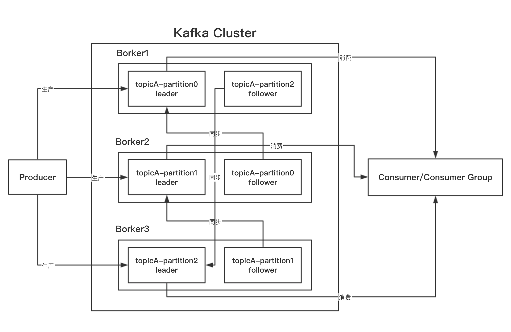

# Kafka 简单介绍

## 1 什么是 Kafka

kafka是分布式的流数据处理平台，其特点主要为：

- 使用生产者消费者模式，发布和订阅数据流，类似其它MQ系统（Producer API和Consumer API）
- 将流数据进行持久化保存，并且具有集群备份的功能，具有较高的容错性
- 针对持久化的流数据可以更进一步的进行操作（Stream API）

kafka通常应用在两个大类场景：

- 在系统与应用之间建立可靠的实时的流处理管道
- 创建流处理应用，用于传输或者在进一步处理流数据

> 第一个场景一般为系统日志收集，系统状态监控，用户行为收集等。第二个场景则为多个应用之间的数据传输，甚至在传输过程当中可以使用kafka stream进行数据处理

## 2 Kafka 其它一些概念

- kafka是依赖于zookeepre实现的分布式，所以部署kafka环境的时候，必须先启动zookeeper
- kafka将不同分类的数据称呼为topic
- kafka中每一条数据都包含：key，value和timestamp

## 3 Kafka 提供的API

- Producer API：生产者api，支持多种语言，应用使用此api生产数据到kafka
- Consumer API：消费者api，支持多种语言，应用使用此api从kafka消费数据
- Stream API：应用按照流处理的方式，从一个topic中使用InputStream读取数据并进行相应的数据，然后使用OutputStream写入到另外一个topic中
- Connector API：使用此api可以在kafka和应用或者数据库之间创建可复用的生产者或者消费者，使应用本身与kafka生产者或者消费者解耦。如果将kafka与关系型数据库连接起来，甚至可以捕获到数据库中的每一次变动

## 4 Kafka 集群的一些概念和特点

- Broker：kafka集群当中，每台物理机器（或者说每启动的一个kafka实例）都称呼为broker。启动kafka实例的时候，需要在kafka配置文件里填写一个配置broker.id，此id为整数，并且整个集群唯一
- Topic：kafka保存数据，按照topic来进行分类，topic是逻辑上的概念，并没有物理上的概念
- Partition：partition及为分片，物理上概念，每个partition都会在硬盘上单独维护一个目录(目录内保存一些文件，其中一部分是被序列化后并持久化的数据)，当一个topic数据量特别大的时候，可以配置partition，将topic中的数据进行分片(及分布式)保存。partition可以在创建一个topic的时候进行配置，类型为整数
    > 这里有一个与其它分布式系统不一样的地方，就是partition是有id的，并且id是从0开始的整数，无法配置。之所以有这个id，我个人猜测，是因为kafka支持生产者将数据生产到指定分区，消费者也可以从指定分区消费数据。当然如果不指定分区，那么数据会被以轮询的方式生产到topic的partition或者被消费。那么问题来了，如果我生产者和消费者在代码中写死0分区，那岂不是分布式就没有意义了？
- Leader和Follower：针对partition的备份者与被备份者的主从关系，在其它集群里最容易类比的概念及master和slave，所以这里的leader是主，follower是从。一旦leader挂了，则follower负责选举出新的leader
    > 这里需要注意的一点是，正常的master和slave模型，master负责读写，slave负责读，但是在kafka当中leader负责读写，follower只负责同步数据
- replication-factor：该名词实际上是创建一个topic的时候，用来指定数据的备份数量的，用备份数量来描述也并不是特别准确，因为这里的数量是leader+follower的数量，而不是单纯指follower数量。需要注意的是，该参数不能大于broker数量

Kafka 集群结构图

## 5. Kafka 常用场景

### 5.1 kafka当作Message Queue

- 相比于传统的mq系统，kafka同样是publish-subscribe模式运作。
- kafka的数据在每个partition都是顺序保存，在单partition里保证了数据顺序性。多partition的情况下，消费顺序也和生产顺序一致，保证整体顺序性(如果是批量生产，则消费的时候也有可能是批量消费，有可能会产生顺序问题)
- kafka会把所有生产到topic的数据进行持久化保存，并且不会删除已经被消费的数据（可以配置删除历史数据），每个消费者在订阅的时候，可以配置是否从第一条数据开始消费，还是从最新的数据开始消费。
- kafka支持消费者组的概念，可以将一个消费者组看成一个巨大的消费者，因为topic里的数据只会被消费者组里的一个消费者消费，从整体上看是被这个巨大的消费者消费了，从局部看，其实是被消费者组里的一个消费者消费了。消费者组的设计支持消费者的消费能力水平扩容，可以启动多个消费者线程去消费一个topic而不会消费到重复数据

### 5.2 kafka当作存储系统

基于上述的kafka集群结构，kafka同样可以分布式持久化数据，并且具有较高的数据容错，所以可以当作一种存储系统来使用

### 5.3 kafka 的流处理

kafka流处理是针对topic与topic之间的流处理，把一个topic当作源头，另外一个topic当作目的，使用kafka stream将二者进行串联起来，其中进行一些数据处理

## 6 kafka 常用实例

- MQ系统
- 日志收集
- 系统监控
- 用户web行为跟踪
- 将收集的数据通过流处理进一步加工后生产到新的topic
