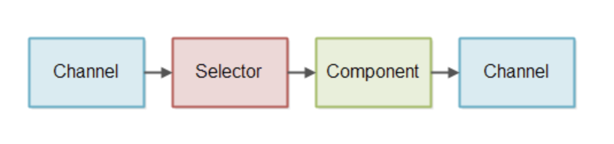
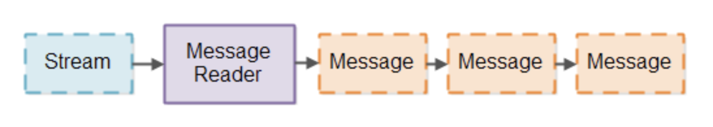
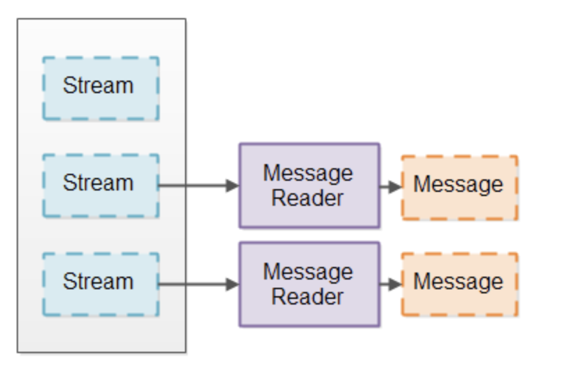
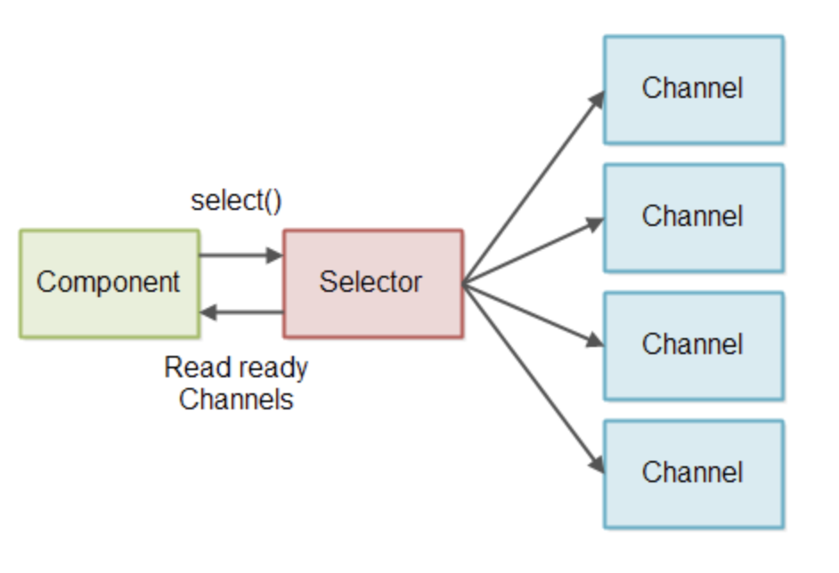
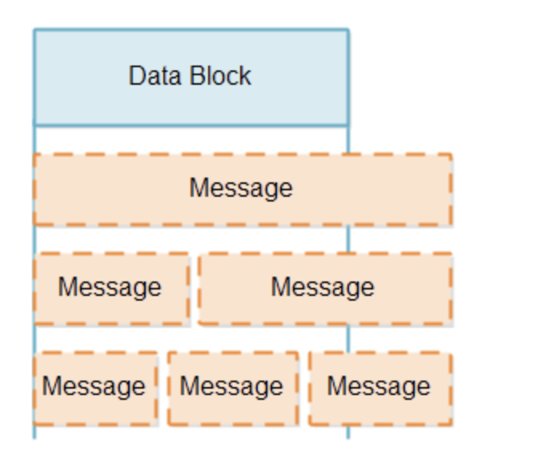
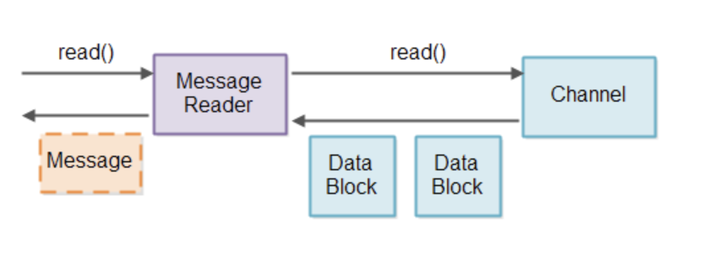
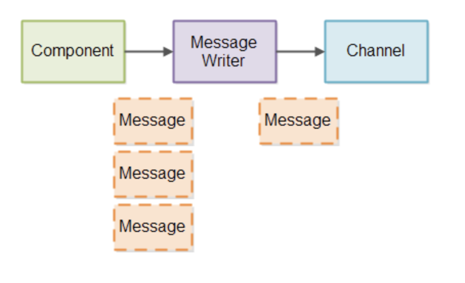
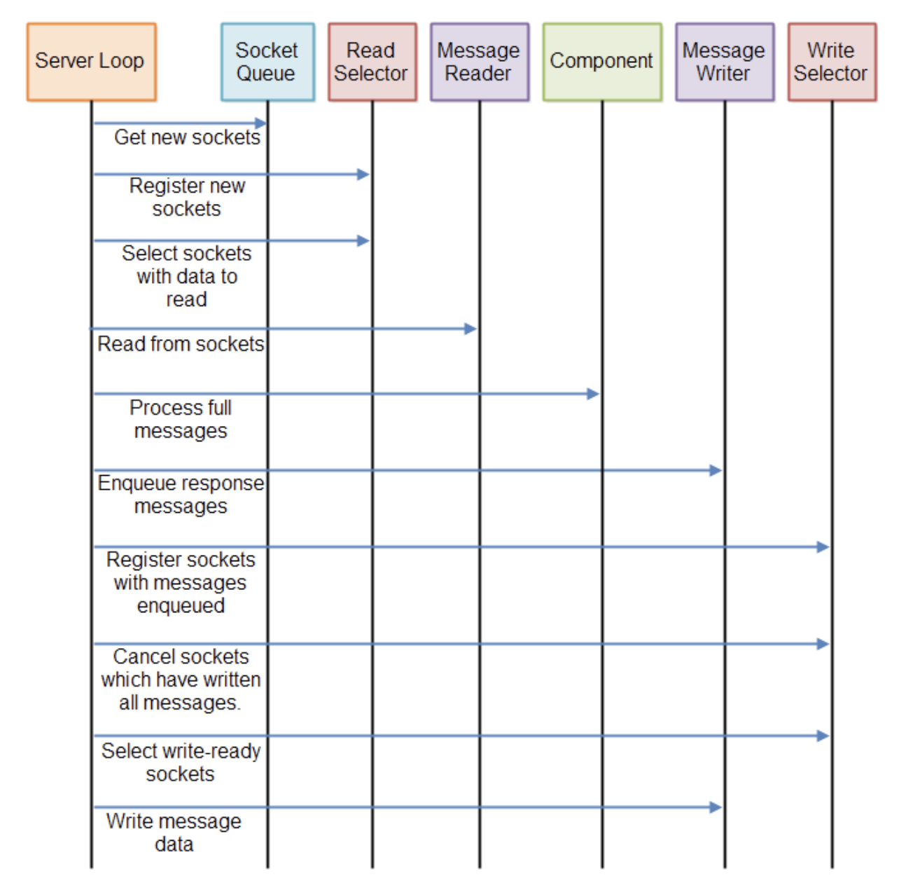

# Non-blocking Server

即使了解 Java NIO 的使用方式，去设计一个 non-blocking server 还是一件非常困难事情。本篇文章将简单介绍一下在设计 non-blocking server 中存在的一些挑战，以及简单列举一些潜在的解决方案。

## Non-blocking IO Pipeline

一个 Non-blocking IO Pipeline 指的是一组 components 直线一个完整的 non-blocking IO。其中包括 reading 和 writing IO。下图是个简单的展示

一个 component 使用 Selector 检查 Channel 中是否有数据需要读取。然后这个 component 读取输入的数据，并且基于输入的数据进行数据输出，输出的数据同样也会再次写入到 Channel 中。

一个 non-blocking IO pipeline 并不是必须要既能 read 也能 write，一些 pipleines 也许只需要 read 或者 write。

上述图只是展示一个简单的 component，一个 non-blocking IO pipeline 也许会有多个 component 用来处理读取的数据。所以一个 non-blocking IO pipeline 的长短，取决于这个 pipeline 具体需要做的事情。

一个 non-blocking IO pipeline 也许需要从多个 Channels 同时读取数据，比如，从多个 SocketChannels 中读取数据。

上述图中展示的流程控制其实非常简单。Component 发起读取动作，并通过 Selector 从 Channel 中读取数据。这里并不是 Channel 将数据 push 到 Selector，然后将数据从这里丢进 component。即使上图从顺序行看起来像这样。

## Non-blocking vs Blocking IO Pipelines

Non-blocking IO pipeline 和 Blocking IO Pipeline 最大的区别就是从底层的 Channel（socket 或者 file）中读取数据的方式。

IO pipeline 通常从一些 stream（socket 或 file）中读取数据，然后将数据切分成一小块连续的 message。这类似于将数据流分解成标记，以便使用标记器进行解析。只不过这里，你一串数据流变成了一些更大的 messages。这里，我把将流转换为 messages 的 component 称为 “Message Reader”。下面是一个简单的图展示。

一个 Blocking IO pipeline 可以使用 InputStream-like interface 来读取底层的 channel 的数据。并且 InputStream-like interface 会 block 直到有数据可读。这种就是 Blocking Message Reader 的实现方式。

使用一个 Blocking IO interface 对接 stream 的方式，大大简化了 Message Reader 的实现方式。一个 Blocking Message Reader 永远不需要处理一个 stream 中没有数据可读的情况，或者只有一小部分的 message 被从 stream 中读取，以及这些 message 在读取之后可能需要重新读取的情况。

同样的，一个 Blocking Message Writer（一种 component 用来向 stream 中写入 messages）也不需要处理只有一个 message 的一部分需要写入的情况，以及 message 在写入之后需要重新写入的情况。

### Blocking IO Pipeline 缺点

虽然 Blocking Message Reader 非常容易实现。它有一个不幸的缺点，那就是需要为每一个需要被分割成消息的流建立一个单独的线程。之所以要这样做，是因为每个 stream 的 IO interface 都会阻塞，直到有一些数据要从它那里读取。也就是说，当一个 thread 从一个 stream 中读取数据，但是这个 stream 中没有数据的时候，它也不能尝试从另一个 stream 中读取。只要一个线程试图从一个 stream 中读取数据，thread 就会 block，直到真的有一些数据可以读取。

如果这个 IO pipeline 是 server 的一部分，并且处理非常多的并发 connections，这个 server 会对每个 connection 都分配一个 thread。当 server 里只有几百个并发 connections 的时候并不会产生问题。但是如果并行数量超过百万，这种设计将无法负担这种规模。假设每个 thread都会占用 320K（32 bit JVM） 或者 1024K（64 bit JVM） 的 stack 内存。那么 1000000 个 threads 会占用 1TB 的内存。并且这还没有计算 server 对之后收到的 message 进行 process 分配的内存。

为了保持 threads 数量不会太高，许多 server 会使用 thread pool 设计。这个线程池一次会读取一个入站的 connection，所有的 connections 会被保存成一个队列，线程按照入站顺序处理每个 connection。如下图。

但是，这种设计要求所有入站的 connections 需要足够频繁的发送数据。如果入站的 connections 长时间不活跃，那么数量庞大的非活跃 connections 仍然会 block 足够多的 thread，导致 thread pool 中的资源全部被用光。最终导致 server 响应变慢甚至无响应。

一些 server 会设计一种具有弹性扩张的 thread pool 来缓解这种问题。比如，如果 thread pool 中的资源都被用光了，那么会启动新的 thread 来增加负载能力。这种解决方案意味着，除非有非常多的 slow connections 才会导致 server unresponsive。但是，这仍然会存在一个 thread 数量上限。所以它仍然不能扩展到足够负担 1000000 这个数量级别的 slow connections。

## Basic Non-blocking IO Pipeline Design

一个 non-blocking IO pipeline 可以使用 single thread 从多个 streams 中读取 messages。这要求 streams 可以切换为 non-blocking 模式。当处于 non-blocking 模式的时候，一个 stream 读取数据的时候， 会返回 0 个或者多个 bytes 。0 bytes 意味着 stream 里没有可读取的数据。大于等于 1 bytes 意味着 stream 里确实有数据需要被读取。

为了避免检查 stream 中是否是 0 bytes，我们使用 Java NIO Selector。一个或更多 SelectableChannel 实例可以被注册到一个 Selector 中。当你调用 Selector 中的 select() 或者 selectNow() 方法时，Selector 只会给你真的有数据需要读取的 SelectableChannel 的实例。如下图。

## Reading Partial Messages

当我们从 SelectableChannel 中读取一小块（a block of data）数据的时候，我们并不知道这一小块数据是小于还是大于一个完整的 message。一个数据块（a data block），可能包含一个完整的 message 中的一部分，或者一个完整的 message，或者大于一个完整的 message。比如 1.5 或 2.5 个 messages。如下图。

在处理这种局部 messages 的时候，需要解决两个问题：

  1. 检测一个 data block 中是否包含一个完整的 message。
  2. 对于一个完整的 message，在剩余的部分 message 到达之前，如何处理已经收到的部分 message。

检测完整的 messages 要求 Message Reader 查看 data block，看里面是否包含至少一个完整的 message。如果 data block 当中包含一个或多个完整的 messages，那么这些 messages 可以发送到 pipeline 中的下一步进行 processing。**查看是否有完整的 messages 这个 process 将会被频繁的循环执行，所以这个 process 必须越快越好。**

每当一个 data block 中存在一个完整的 message 的一部分的时候，即使之后收到了一个或多个其它的完整的 message，这部分残缺的 message 都必须被存储起来，直到该 message 的剩余部分全部从 channel 中接收到。

检测是否有完整的 messages 和 将残缺的部分 message 存储起来，都是 Message Reader 需要做的事情。为了避免从不同的 Channel 中读取的 message 混在一起，我们会为每个 Channel 提供一个 Message Reader。设计如下图。

当然一个 Message Reader 一定是特定到某个 protocol 的。因为 Message Reader 需要直到一个完整的 message 的格式才能读取。如果我们的 server 实现可以跨协议重用（resuable across protocols）。则它需要实现可插入的 Message Reader。即通过 Message Reader factory 座位配置参数。

## Storing Partial Messages

目前，我们已经确定 Message Reader 需要保存残缺的 message，接下来，我们要探索如何实现存储方式。

这里有两个设计问题需要我们进行思考：

  1. 我们要尽可能的少 copy message，copy 的越多，性能越差。
  2. 我们希望完整的消息以连续的字节序列存储，以便于解析消息。

### A Buffer Per Message Reader

很显然，残缺的部分 messages 需要被存储到某种 buffer 中。最直接的实现方式就是给每一个 Message Reader 都分配一个 buffer。但是，这个 buffer 的大小应该如何定义？首先想到的是大小应该足够放下最大的一个完整的 message。如果说一个最大的完整 message 的大小为 1MB，那么一个 buffer 的大小也应该设置为至少 1MB。

但是实际上，对每个 connection 都分配一个 1MB 大小的 buffer 并不可行。如果说存在 1,000,000 个 connections。最后还是会占用 1TB 的内存，更别说存在一些 message 大小为 16MB 或者 128MB。

### Resizable Buffers

另外一种方式是实现可调整大小的 buffer 提供给 Message Reader。这个 buffer 最开始会非常的小，如果 message 变大，则 buffer 容量也会随之扩大。这样以来，每一个 connection 将没有必要一开始就申请 1MB 的 buffer，它们只会占用足够包含一个完整 message 大小的内存容量。

当然，有许多i中国年方式去实现可调整大小的 buffer。每一种都有自己的优缺点。接下来会对每一个实现方式进行简单的讨论。

### Resize by Copy

第一种实现方式，首先 buffer 会被初始化一个非常小的大小，比如 4KB。如果一个完整的 message 无法完整的存入 4KB buffer。那么一个新的 buffer 会被初始化，比如说初始化一个新的 8KB 大小的 buffer。然后将 4KB 中的数据 copy 到 新的 8KB buffer 中。

resize-by-copy 的优点是，数据仍然保持这序列顺序，这会让之后的解析 message 环节变得非常容易。

缺点则是如果 message 非常大。那么就会产生一次非常大数据量的 copy 动作。

为了减少数据 copying，你可以分析流经系统的消息的大小，以找到一些可以减少复制量的缓冲区大小。比如，当你发现大多数 message 的大小都是小于 4KB 的。那么初始化 buffer 的时候，将大小默认为 4KB 比较合适。

但是，你仍然会看到一些 message 大于 4KB，比如说一个文件。然后，你会发现大多数流经系统的 file 大小都小于 128KB。所以将 buffer 的第二个大小设置为 128KB 比较合理。

最后你可能会发现，一旦消息超过128KB，消息的大小就没有真正的规律可言了，所以也许最后的 buffer 大小应该只是最大的消息大小。

对于这三种 buffer 大小，你也许会因此减少数据的 copy。小于 4KB 的 message 永远不会被 copied。对于 1,000,000 个并发 connections，会占用 4GB 的内存。对于大于 4KB 小于等于 128KB 的 messages，只会 copy 一次。对于大于 128KB 小于等于最大 message 大小的 message，会copy 两次。因为大于 128KB 的消息非常少见，所以这种方式是可以接受的。

一旦一个完整的 message 被接收，并且被之后的环节 process。那么被分配的内存就可以释放了。这样当下一个 message 从相同的 connections 传输郭阿里的时候，buffer 会从最小大小开始接受。这是必要的，以确保连接之间可以更有效地共享内存。很有可能不是所有的连接都同时需要大的缓冲区。

### Resize by Append

另外一种方式进行 resize 一个 buffer，就是让 buffer 由多个 arrays 组成。当你需要 resize 这些 buffer 的时候，只需要给 buffer 分配另外一个 byte 类型的 array 用来数据写入即可。

这里有两种方式来扩容这种 buffer。第一种是给 buffer 分配另外一个 byte arrays，buffer 内部将 所有的 byte arrays 保存为 list。另外一种方式是创建一个非常大的共享 byte array，然后给 buffer 分配其中一个切片，并保留分配给 buffer 的切片列表。个人觉得第二种方式更加合适，但是两种方式的区别非常小。

这两种扩容方式的优点是，不需对数据进行 copy 操作。所有的数据都可以直接从 channel 中直接写入 array 或者 slice（切片）

这两种扩容方式的缺点是，数据没有保存到一个单独的连续的 array 中。这会使之后对 message 的解析变得困难，因为解析器（parsers）需要同时检查每个 array 的末尾，以及所有 arrays 的末尾。正因为徐亚哦在写好的 message 中寻找消息末尾，所以这种模型不太容易操作。

### TLV Encoded Messages

一些 protocol message formats 会把数据编码成  TLV （Type，Length，Value）格式。意思是一个完整的 message 会把自己的总大小保存到 message 的内容开头。这样你就能直接知道整个 message 需要分配多少内存了。

TLV encodings 让内存管理变得更加容易了。你会立刻知道当前 message 的总大小，这样在你分配内存的时候，就不会浪费内存了。

对于 TLV 的缺点，就是你在还没有接收到完整的 message 的时候，你就必须先分配好足够大的内存。一些 slow connections 会发送一些非常大的 message，这样你就需要分配足够大的可用内存，这样也会导致 server unresponsive。

对上述问题也有一种解决方式，message 并不会只存在一个 TLV。而是会在整个 message 中存有多个 TLV fields。所以我们只需要为每个 TLV fields 分配内存，而不是整个 message。当然，非常大的 TLV field 同样会导致同样的问题。

另外一种解决方式就是设置 timeout。比如 10-15 秒。这样可以让你的 server 从同时出现许多较大的 message 中恢复过来。当然这总会导致你的 server unresponsive 一段时间。另外。一个估计的 DoS （Denial of Service）攻击也会将服务器中的内存消耗干净。

TLV encoding 存在多个变体。具体使用多少个字节，所以指定字段的类型和长度取决于每个单独的TLV编码。这里也有 TLV encoding 格式会把 length 放到 field 中的第一个，然后是 type 和 value（即 LTV encoding）。当然。虽然这三个描述的顺序发生了变化，但是仍然算是 TLV encoding。

事实上，TLV encoding 使内存管理更容易，这也是 HTTP 1.1 是一个可怕的协议的原因之一。同时也是 HTTP 2.0 中试图解决的问题之一，在 HTTP 2.0 中，数据是以 LTV encoding 的帧来传输的。

## Writing Partial Messages

然而，在 non-blocking IO pipeline 中写数据也存在一些问题。当我们在处于 non-blocking 模式的 channel 中调用 write(ByteBuffer) 方法的时候，无法保证到底有多少 bytes 从 ByteBuffer 中被写入到 channel。write(ByteBuffer) 方法会返回多少 bytes 被写入，所以可以一只追踪写入的 bytes 数量。所以这里又个问题：跟踪部分写入的数据，以便最后确保一个完整的 message 的所有数据都被发送。

为了管理写入部分 message 到 channel，我们创建一个 Message Writer。就像 Message Reader 一样，我们会确保每一个 Channel 都会又个 Message Writer 来进行数据写入。 在每个 Message Writer 中我们会跟踪实际有多少 bytes 被写入。

如果需要被写入的数据数量超过了 Message Writer 可直接写到 channel 的数量，那么这些 message 就需要在 Message Writer 中进行队列排序。Message Writer 会尽快将所有需要待写入的 message 写入到 Channel 中。如下图所示。

为了让 Message Writer 能够发送之前只发送了一部分的消息，需要时常调用 Message Writer，这样它才能发送更多的数据。

如果你有许多 connections，那么你也会有许多 Message Writer 实例。假如有百万级别的 Message Writer 实例，那么就会导致写入数据变慢。首先大部分 Message Writer 实例并不会有数据需要发送。我们并不想检查这些 Message Writer。其次，并不是所有的 Channel 都以及准备好写入数据。我们也不想浪费时间去尝试把数据写入一个还不能接收数据的 Channel。

为了检查一个 Chnanel 是否已经准备好了写入，我们将 Channel 注册到了 Selector。然而，我们并不想将所有的 Channel 都注册到 Selector。如果我们有 1,000,000 个 connections 并且大部分都处于空闲状态，然后把所有的 connections 都注册到 Selector 中。之后我们调用 select() 方法，那么大部分 Channel 都是可以被写入的状态（write-ready），因为大部分 connections 都处于空闲状态（idle）。所以你需要检查所有 write-ready 的 connections 对应的 Message Writer 是否有数据需要被写入。

为了避免检查所有的 Message Writer 实例，尤其是那些没有数据需要被写入的。我们使用两步来实现：

  1. 当 message 被写入到 Message Writer，Message Writer 才将和它关联的 Channel 注册到 Selector（如果之前没有被注册的话）。

  2. 当 server 有时间，则它回去检查 Selector 看有多少 Channel 已经 write-ready。然后将对应 Channel 的 Message Writer 中的数据写入 Channel。一旦 Message Writer 将所有的 messages 写入 Channel。那么这个 Channel 将从 Selector 中取消注册状态。

## Putting it All Together

如你所见，non-blocking server 需要不时地检查传入的数据，以查看是否有任何新的完整消息收到。服务器可能需要检查多次，直到收到一个或多个完整的消息。检查一次是不够的。

同样，non-blocking server 需要不时地检查是否有数据需要被写入。如果有，服务器需要检查是否有任何一个相应的连接已经准备好将该数据写入它们。只在消息第一次排队时检查是不够的，因为消息可能会被写入一部分。

一个 non-blocking server 需要定期执行三条 pipeline：

  1. Read Pipeline，从被打开的 connections 中检查收到的数据
  2. Process Pipeline，处理收到的完整的 message。
  3. Write Pipeline，检查是否可以数据输出到已经被打开的 connections

这三个 pipelines 将在一个循环中反复被执行。其中也许有一些可以优化的地方。比如，如果没有数据需要被输出，那么完全可以跳过 write pipeline，等等。

下图是个完整的循环展示。

