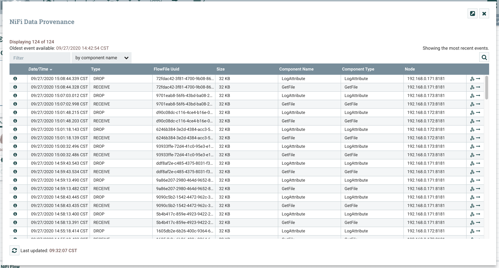
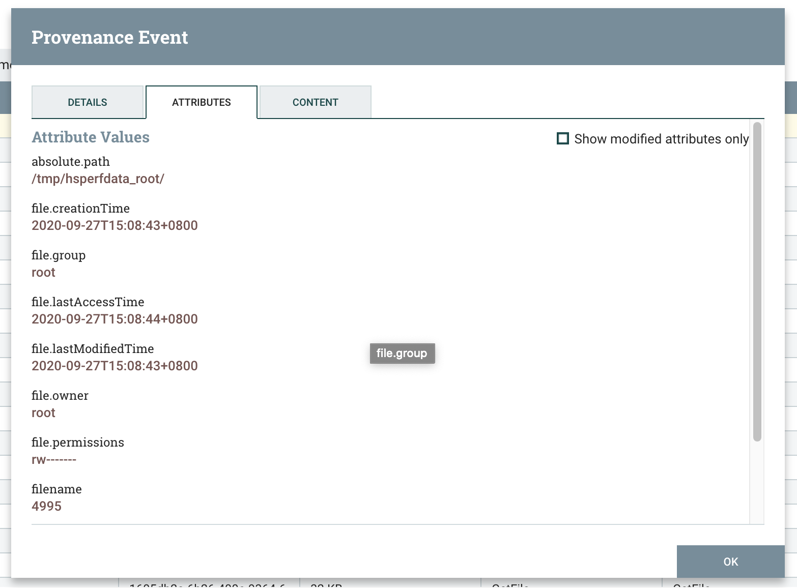

# NiFi 简单使用

## 1 如何开始

### 1.1 添加 Processor

首先可以看到NiFi的主界面分为上边的菜单栏，侧边的导航窗口，以及中间的画布

在 NiFi 上面的菜单栏中可以拖动 Processor 按钮到画布中来添加一个 Processor。

拖到画布中后会出现一个对话框，需要我们选择 Processor 的类型

具体 Processor 有哪些之后介绍，这里我们选择一个 GetFile，用于读取本地文件。在搜索框中搜索 local 关键字，发现出现三个选项，这里选择 GetFile。选择了我们需要的 Processor 之后，对话框的下方会出现文字描述，简单的介绍这个 Processor 的具体功能，在我们不太了解 Processor 的时候，可以多多留意这部分内容。最后点击 ADD 按钮完成添加。

### 1.2 配置 Processor

添加完成之后，这个 Processor 并不是可使用状态，我们需要对它进行配置，鼠标放在 Processor 上，点击右键弹出对话框，然后点击 configuration 按钮。

可以看到弹出一个配置对话框，里面提供了很多的配置属性，具体详细内容我们之后再讲，这里先简单的进行一下配置，做一个 demo。首先配置对话框里有四个标签，这里我们先忽略其它三个标签，这里只关注 PROPERTIES 标签，点击 PROPERTIES 标签。

里面有许多属性，有的有默认值有的没有，我们需要关注的是字体加粗的配置，加粗表示必填的配置，可以看到除了“Input Directory”配置外，其它必填项都已经有了默认值，所以我们只需要补充“Input Directory”配置即可。将鼠标移动到配置名称后的问号上，即可看到针对这个配置的描述。

> Expression language 是指是否支持表达式，NiFi中很多配置支持表达式，具体是否支持，需要我们鼠标移动到问号上去查看。针对这部分的具体使用，请参考 **3.5 表达式语言/在属性值中使用属性**。

很明显，这个配置是用来决定我们获取的本地文件的目录路径，如果是相对路径，则从 NiFi home 目录开始，如果是绝对路径，则按照绝对路径走。注意是目录路径，而不是文件路径。这里我们随便填一个即可，注意在服务器中一定要有这个目录，没有的话需要我们手动去创建一下。这里我们填 /tmp，然后点击 APPLY 应用配置。

### 1.3 连接 Processors

对于每一个 Processor 都有一个一组关系状态（Relationships）用来决定数据用于发送到哪儿。当 Processor 处理完一个 FlowFile 后，会将数据发送到某一个 relationship。这允许用户通过 Processor 的处理结果来决定 FlowFile 的走向。举个例子，许多 Processor 都定义有两种 relationships：failure 和 success。用户可以通过配置，当 Processor 执行成功后走一条路线，某种原因失败则走另外一条路线。或者基于用户场景，在两种 relationship 下都走同一条路线也是可以的。

那么我们之前已经配置好了一个 GetFile 的 Processor，并且进行了基本配置。但是这个 Processor 还不能工作。在 GetFile 的左上角我们可以看到一个警告标志，鼠标移动上去即可看到当前 Processor 不能使用的 state 原因。在这里，提醒的是由于我们没有配置 GetFile 的 success relationship。

为了解决这个问题，我们将再创建一个 Processor 来连接之前的 GetFile，创建方式还是和上面一样，不过这次我们将创建一个用来记录 FlowFile 属性的 Processor，即 LogAttribute。直接 ADD 无需配置。

我们可以将 GetFile 的输出发送到 LogAttribute。点击 GetFile 最中间的箭头图标不松开，然后拖动鼠标，即可拖动出一条箭头，将光标移动到 LogAttribute 上松开，就可以将箭头从 GetFile 指向 LogAttribute。这样我们就建立了一条 connection，当我们松开鼠标的一瞬间，会立刻弹出一个对话框，要求我们对这个 connection 进行配置。其中有一个就是让我们选择 connection 所接受的 relationships 是哪个。

点击 SETTING 按钮可以看到跟多的配置，来决定这个 connection 的行为。

我们可以给这个 connection 起一个名称，当然如果不起的话，名称会自动按照所选的 relationship 来命名。我们同样可以设置数据的过期时间（FlowFile Expiration），设置为 0 Sec 则意味着永远不过期，否则，当在 connection 中停留的数据达到过期时间后，就会被 connection 自动删除（当然与之相应的过期事件就会被创建）。

Back Pressure Threshold 允许我们设置connection 里的队列的最大值。这允许我们处理一种情况，就是前面 Processor 的处理速度要比后面的 Processor 处理速度快，那么必然就会有数据堆积在 connection 的队列里。如果我们在一条线路中的每个 connection 中都配置了 backpressure，那么最先带入数据的 Processor 最终将遭遇到 backpressure 事件，那么这个 Processor 将停止获取新的数据，以便于我们的系统恢复。

最后，我们在对话框的右边可以看到优先级配置，这允许我们控制在队列中的数据排序方式。我们可以在可用优先级（Available Prioritizers）中拖拽配置到选择的优先级（Selected Prioritizers）当中来激活优先级配置。如果多个优先级配置被选择，那么顺序将会按照我们配置的顺序来决定优先级，如果有多个 FlowFile 具有相同的优先级，那么第二个优先级配置将会被用来进行对比，之后以此类推。

基于上面的介绍，我们可以简单的根据需求进行配置，或者什么都使用默认，然后点击 ADD 按钮完成 connection 的添加。

我们可以看到 GetFile 的警告标志变成了一个灰色的停止标志。但是 LogAttribute 却出现了之前的警告标志，鼠标移动上去可以看到，success relationship 没有被任何 connection 连接导致。不过这次我们可以使用另外的方式来处理这个问题，即让 LogAttribute 的 relationship 为 success 的时候自动关闭（Auto Terminaled）。自动关闭的意思是 NiFi 会考虑将执行完成的 FlowFile 中的数据“drop”。为此，我们需要配置一下 LogAttribute。

配置完成之后，我们可以看到两个 Processor 的状态目前都是 Stopped。

### 1.4 启动和停止 Processors

至此，我们拥有了两个配置好的，相互连接的 Processor。为了启动 Processor，我们选中其中的一个 Processor，然后右键点击，再点击弹出框中的 start 按钮启动(启动不是真的运行，只是启动)。每一个 Processor 都可以用这样的方式启动。或者按住 shift，然后多选 Processor，在任意一个 Processor 上右键点击 start 都可以启动所有被选中的 Processor。或者在整个画布左边的导航窗口上直接点击启动按钮即可启动所有的 Processor。

一旦 Processor 启动，则不能进行修改配置操作，鼠标右键点击 Processor 后，新出现的查看配置按钮替代了原来的配置按钮。如果想修改配置，必须先停止 Processor 然后等到 Processor 正在执行的任务完成。当前正在执行的任务数量会显示在 Processor 的右上角，如果没有任务再执行，则什么都不会显示。

### 1.5 获取 Processor 的更多信息

每一个 Processor 都有许多不同的属性配置和 relationships，在如此多的 Processor 下，我们很难记住每一个 Processor 的信息。因此，我们可以右键点击 Processor 然后点击 Usage 按钮，这会弹出这个 Processor 非常详细的使用文档对话框。其中包含：Processor 的描述，不同的 Relationship 的使用场景，期望的配置信息，还有对于接收的 FlowFile 所需要的指定属性，会在输出的 FlowFile 上添加那些属性，等等。

### 1.6 其它组件（Components）

NiFi 的工具栏（toolbar）提供了许多不同的组件便于用户去创建和删除，来组件自己的数据流（dataflow）。这些组件包括：Input and Output Ports，Funnels，Process Groups 和 Remote Process Groups。不过这些组件的具体介绍不在此文章的范围内，之后会有单独的文章进行介绍。

## 2 如何选择 Processor

为了建立高效的数据流（dataflow），我们必须使用合适的 Processor 来完成我们的工作。NiFi提供了许多类型的 Processor 供我们选择，这些 Processor 提供了许多能力，比如从不同的系统中获取数据（ingest data from numerous different systems），路由（route），转换（transform），运算（process），切片（split）以及合并（aggregate）数据，最后将数据分发到各种不同的系统当中。

几乎在每个发布的 NiFi 版本中都会伴随着许多的 Processor 一同发布。最后，我们不会具体介绍每一个 Processor，但是我们标注一些使用频繁的 Processors，并且根据他们的功能进行简单的分类。

### 2.1 数据转换（Data Transformation）

- **CompressContent** - 压缩或解压数据
- **ConvertCharacterSet** - 转换字符集，一般是用于将数据从一种字符集编码成另外一种
- **EncryptContent** - 加密或解密数据
- **ReplaceText** - 使用正则表达式去修改文本类型的数据
- **TransformXml** - 对 XML 内容进行 XSLT 转换
- **JoltTransformJSON** - 应用JOLT规范来转换JSON内容

### 2.2 路由和调解（Routing and Mediation）

- **ControlRate** - 节流数据流经某一部分的速度。
- **DetectDuplicate** - 基于一些用户定义的标准，监控是否有重复的FlowFiles。经常与HashContent一起使用。
- **DistributeLoad** - 通过将数据的一部分分配给每一个用户定义的 Relationship 来进行负载平衡或样本数据。
- **MonitorActivity** - 当用户定义的一段时间内没有任何数据通过数据流中的某一点时，发送一个通知。当数据流恢复时，可选择发送通知。
- **RouteOnAttribute** - 根据 FlowFile 包含的属性进行路由。
- **ScanAttribute** - 扫描 FlowFile 上用户定义的属性集，检查是否有任何属性与用户定义的字典中的术语相匹配。
- **RouteOnContent** - 搜索 FlowFile 的内容，以查看它是否匹配任何用户定义的正则表达式。如果符合，则 FlowFile 将被路由到配置的 Relationship 中。
- **ScanContent** - 搜索 FlowFile 的内容，查找用户定义的字典中存在的术语，并根据这些术语的存在与否进行路由。字典可以由文本条目或二进制条目组成。
- **ValidateXml** - 对照XML Schema 验证 XML 内容；根据 FlowFile 的内容是否根据用户定义的 XML Schema 有效来路由 FlowFile。

### 2.3 数据库连接（Database Access）

- **ConvertJSONToSQL** - 将 JSON 文档转换为 SQL INSERT 或 UPDATE 命令，然后可以传递给 PutSQL 处理器（Processor）。
- **ExecuteSQL** - 执行用户定义的 SQL SELECT 命令，将结果以 Avro 格式写入 FlowFile。
- **PutSQL** - 通过执行 FlowFile 的内容所定义的 SQL DDM 语句来更新数据库。
- **SelectHiveQL** - 对 Apache Hive 数据库执行用户定义的 HiveQL SELECT 命令，将结果写入 Avro 或 CSV 格式的 FlowFile 中。
- **PutHiveQL** - 通过执行 FlowFile 的内容所定义的 HiveQL DDM 语句来更新 Hive 数据库。

### 2.4 属性提取（Attribute Extraction）

- **EvaluateJsonPath** - 用户提供 JSONPath 表达式(类似于用于 XML 解析/提取的 XPath )，然后这些表达式针对 JSON 内容进行评估，以替换 FlowFile 内容或提取值到用户命名的 Attribute 中。
- **EvaluateXPath** - 用户提供 XPath 表达式，然后这些表达式会针对 XML 内容进行评估，以替换 FlowFile 内容或将值提取到用户命名的Attribute中。
- **EvaluateXQuery** - 用户提供一个 XQuery 查询，然后这个查询会根据 XML 内容进行评估，以替换 FlowFile 内容或提取值到用户命名的 Attribute 中。
- **ExtractText** - 用户提供一个或多个正则表达式，然后根据 FlowFile 的文本内容进行评估，然后将提取的值添加为用户命名的属性。
- **HashAttribute** - 对用户定义的现有属性列表执行哈希函数。
- **HashContent** - 对 FlowFile 的内容执行散列函数，并将散列值添加为一个属性。
- **IdentifyMimeType** - 评估一个 FlowFile 的内容，以确定 FlowFile 封装的文件类型。该处理器能够检测许多不同的 MIME 类型，如图像、文字处理文档、文本和压缩格式等。
- **UpdateAttribute** - 添加或更新任意数量的用户定义的属性到 FlowFile。这对于添加静态配置的值，以及通过使用表达式语言动态地获取属性值非常有用。该处理器还提供了一个 "高级用户界面（Advanced User Interface）"，允许用户根据用户提供的规则有条件地更新属性。

### 2.5 系统交互（System Interaction）

- **ExecuteProcess** - 运行用户定义的操作系统命令。进程的 StdOut 被重定向，使写入 StdOut 的内容成为出站 FlowFile 的内容。该处理器是一个源处理器（Source Processor）- 它的输出被期望生成一个新的FlowFile，而系统调用被期望不接收任何输入。为了向进程提供输入，使用 ExecuteStreamCommand 处理器。
- **ExecuteStreamCommand** - 运行用户定义的操作系统命令。FlowFile 的内容可以选择流向进程的 StdIn。写入 StdOut 的内容成为出站 FlowFile 的内容。该处理器不能作为源处理器（Source Processor）使用 - 它必须被送入 FlowFiles 以执行其工作。要用源处理器执行相同类型的功能，请参见ExecuteProcess 处理器。

### 2.6 数据抽取（Data Ingestion）

- **GetFile** - 将文件的内容从本地磁盘（或网络连接的磁盘）流进 NiFi，然后删除原始文件。该处理器是用来将文件从一个位置移动到另一个位置，而不是用来复制数据。
- **GetFTP** - 将远程文件的内容通过 FTP 下载到NiFi 中，然后删除原文件。该处理器是用来将数据从一个位置移动到另一个位置，而不是用来复制数据。
- **GetSFTP** - 将远程文件的内容通过 SFTP 下载到 NiFi 中，然后删除原文件。该处理器是用来将数据从一个位置移动到另一个位置，而不是用来复制数据。
- **GetJMSQueue** - 从 JMS 队列中下载一条消息，并根据 JMS 消息的内容创建一个 FlowFile。JMS 属性也可以作为属性复制过来。
- **GetJMSTopic** - 从 JMS Topic 下载消息，并根据 JMS 消息的内容创建 FlowFile。JMS 属性也可以作为属性复制过来。该处理器支持持久的和非持久的订阅。
- **GetHTTP** - 将远程 HTTP 或 HTTPS 的 URL 内容下载到 NiFi 中。处理器将记住 ETag 和最后修改日期，以确保数据不会被不断地摄取。
- **ListenHTTP** - 启动一个 HTTP（或 HTTPS ）服务器并监听传入的连接。对于任何传入的 POST 请求，请求的内容会以 FlowFile 的形式写出来，并返回 200 的响应。
- **ListenUDP** - 侦听传入的UDP数据包，并为每个数据包或每个数据包束创建一个FlowFile（取决于配置），并向 success relationship 发出 FlowFile。
- **GetHDFS** - 监控 HDFS 中用户指定的目录。每当有新的文件进入 HDFS，它就会被复制到 NiFi 中并从 HDFS 中删除。这个处理器是用来将文件从一个位置移动到另一个位置，而不是用来复制数据。如果在一个集群中运行，这个处理器也被期望只在主节点上运行。为了从 HDFS 中复制数据并使其保持不变，或从集群中的多个节点流式传输数据，请参阅 ListHDFS 处理器。
- **ListHDFS / FetchHDFS** - ListHDFS 监控 HDFS 中用户指定的目录，并发出一个 FlowFile，其中包含它所遇到的每个文件的文件名。然后，它通过分布式缓存的方式在整个 NiFi 集群中坚持这种状态。然后，这些 FlowFiles 可以在集群中扩散开来，并发送给 FetchHDFS 处理器，它负责获取这些文件的实际内容，并发出包含从 HDFS 中获取的内容的 FlowFiles。
- **FetchS3Object** - 从 Amazon Web Services (AWS) Simple Storage Service (S3) 中获取对象的内容。出站的 FlowFile 包含从 S3 接收的内容。
- **GetKafka** - 从 Apache Kafka 中获取消息，特别是 0.8.x 版本。这些消息可以作为每个消息的 FlowFile 发出，也可以使用用户指定的定界符将消息集中在一起发出。
- **GetMongo** - 对 MongoDB 执行用户指定的查询，并将其内容写入一个新的 FlowFile。
- **GetTwitter** - 允许用户注册一个过滤器来监听 Twitter "garden hose" 或 企业端点（Enterprise endpoint），为收到的每一条推文创建一个 FlowFile。

### 2.7 数据出口/发送数据（Data Egress / Sending Data）

- **PutEmail** - 向配置的收件人发送电子邮件。FlowFile 的内容可以作为附件发送。
- **PutFile** - 将 FlowFile 的内容写入本地（或网络连接）文件系统的一个目录。
- **PutFTP** - 将 FlowFile 的内容复制到远程 FTP 服务器。
- **PutSFTP** - 将 FlowFile 的内容复制到远程SFTP服务器。
- **PutJMS** - 将 FlowFile 的内容以 JMS 消息的形式发送到 JMS 代理，可以根据属性添加 JMS 属性。
- **PutSQL** - 以 SQL DDL 语句的形式执行 FlowFile 的内容（INSERT, UPDATE, 或 DELETE）。FlowFile 的内容必须是一个有效的 SQL 语句。属性可以作为参数使用，这样 FlowFile 的内容就可以成为参数化的 SQL 语句，以避免 SQL 注入攻击。
- **PutKafka** - 将 FlowFile 的内容作为消息发送到 Apache Kafka，特别是 0.8.x 版本。FlowFile 可以作为一个单一的消息发送，也可以指定一个定界符，如新行，以便为一个 FlowFile 发送许多消息。
- **PutMongo** - 将 FlowFile 的内容以 INSERT 或 UPDATE 的形式发送到 Mongo。

### 2.8 切片和聚合（Splitting and Aggregation）

- **SplitText** - SplitText 接收内容为文本的单个 FlowFile，并根据配置的行数将其分割成1个或多个 FlowFiles。例如，处理器可以被配置为将一个 FlowFile 分割成多个 FlowFiles，每个 FlowFiles 只有1行。
- **SplitJson** - 允许用户将一个由数组或许多子对象组成的 JSON 对象分割成每个 JSON 元素的 FlowFile。
- **SplitXml** - 允许用户将一个 XML 消息分割成多个 FlowFiles，每个 FlowFiles 包含一个原始的片段。当多个 XML 元素被一个"包装"元素（wrapper element）连接在一起时，通常会使用这个处理器。该处理器允许将这些元素分割成单独的XML元素。
- **UnpackContent** - 解压不同类型的存档格式，如 ZIP 和 TAR。归档中的每个文件都会作为单个 FlowFile 传输。
- **MergeContent** - 该处理器负责将多个 FlowFiles 合并为一个 FlowFile。FlowFiles 可以通过将其内容与可选的页眉（header）、页脚（footer）和分界符（demarcator）连接在一起，或者通过指定一种存档格式（archive forma）（如ZIP或TAR）进行合并。FlowFiles 可以根据一个共同的属性将其捆绑（binned together）在一起，如果它们被其他分割过程（Splitting process）分割开来，也可以进行 "碎片整理（defragmented）"。每个 bin 的最小和最大大小由用户指定，基于元素数量或 FlowFiles 内容的总大小，还可以指定一个可选的超时时间，这样 FlowFiles 只会在一定时间内等待其 bin 满。
- **SegmentContent** - 根据配置的数据大小，将一个 FlowFile 分割成许多更小的 FlowFiles。分割不是针对任何类型的分界符，而是基于字节偏移量。这是在传输 FlowFiles 之前使用的，以便通过并行发送许多不同的片段来降低延迟。另一方面，这些 FlowFiles 可以被 MergeContent 处理器使用 Defragment 模式重新组装。
- **SplitContent** - 与SegmentContent类似，将一个FlowFile分割成多个FlowFiles。然而，在SplitContent中，分割不是在任意的字节边界上进行，而是指定一个字节序列来分割内容。

### 2.9 HTTP

- **GetHTTP** - 将远程 HTTP 或 HTTPS 的 URL 内容下载到 NiFi 中。处理器将记住 ETag 和最后修改日期，以确保数据不会被不断地摄取。
- **ListenHTTP** - 启动一个 HTTP（或 HTTPS ）服务器并监听传入的连接。对于任何传入的 POST 请求，请求的内容会以 FlowFile 的形式写出来，并返回 200 的响应。
- **InvokeHTTP** - 执行一个由用户配置的 HTTP 请求。这个处理器比 GetHTTP 和 PostHTTP 更通用，但需要更多的配置。该处理器不能作为源处理器（Source Processor）使用，需要有传入的 FlowFiles 才能触发其任务。
- **PostHTTP** - 执行 HTTP POST 请求，发送 FlowFile 的内容作为消息的主体。这通常与 ListenHTTP 结合使用，以便在不能使用 Site-to-Site 的情况下，在 NiFi 的两个不同实例之间传输数据（例如，当节点不能直接访问对方而能够通过 HTTP 代理进行通信时）。注：除了现有的 RAW 套接字传输外，HTTP 还可以作为 Site-to-Site 传输协议。它还支持 HTTP Proxy。建议使用 HTTP Sit-to-Site，因为它的可扩展性更强，并且可以使用输入/输出端口提供双向数据传输，具有更好的用户认证和授权。
- **HandleHttpRequest / HandleHttpResponse** - HandleHttpRequest 处理器是一个与 ListenHTTP 类似的启动嵌入式 HTTP(S) 服务器的源处理器。然而，它并不向客户端发送响应。取而代之的是，FlowFile 被发送出去，其中 HTTP 请求的主体作为它的内容，所有典型的 Servlet 参数、头文件等的属性作为 Attributes。然后，HandleHttpResponse 能够在 FlowFile 处理完毕后向客户端发送响应。这些 Processor 总是被期望相互结合使用，并允许用户在 NiFi 中可视化地创建一个 Web Service。这对于添加一个前端到一个非基于网络的协议，或者添加一个简单的网络服务，围绕一些已经由 NiFi 执行的功能，如数据格式转换，特别有用。

### 2.10 Amazon Web Services

- **FetchS3Object** - 获取存储在 Amazon Simple Storage Service (S3) 中的对象的内容。然后将从 S3 中获取的内容写入 FlowFile 的内容中。
- **PutS3Object** - 使用配置的凭证、密钥和 bucket 名称将 FlowFile 的内容写入 Amazon S3 对象。
- **PutSNS** - 将 FlowFile 的内容作为通知发送到 Amazon Simple Notification Service (SNS)。
- **GetSQS** - 从 Amazon Simple Queuing Service (SQS) 中提取消息，并将消息的内容写入 FlowFile 的内容中。
- **PutSQS** - 将 FlowFile 的内容作为消息发送到 Amazon Simple Queuing Service (SQS)。
- **DeleteSQS** - 删除 Amazon 简单队列服务（SQS）中的消息。这可以与 GetSQS 配合使用，以便从 SQS 接收消息，对其进行一些处理，然后在成功完成处理后才从队列中删除对象。

## 3 利用属性工作（Working With Attributes）

每个 FlowFile 创建的时候都具有一些属性，这些属性将在 FlowFile 的生命周期内会发生变化。FlowFile 的概念非常强大，并且它提供了三个主要的好处。首先，它允许用户在流程中做出路由决策，从而使满足某些标准的 FlowFiles 与其他 FlowFiles 的处理方式不同。这是通过 RouteOnAttribute 和类似的 Processor 来实现的。

其次，Attributes 被用来配置 Processor，使 Processor 的配置依赖于数据本身。例如，PutFile 处理器能够使用 Attributes 来知道每个 FlowFile 的存储位置，而每个 FlowFile 的目录和文件名 Attributes 可能不同。

最后，Attributes 提供了关于数据的极有价值的上下文。这在审查 FlowFile 的 Provenance 数据时非常有用。它允许用户搜索符合特定标准的 Provenance 数据，还允许用户在检查 Provenance 事件的细节时查看该上下文。通过这样做，用户只需浏览一下与内容一起携带的上下文，就能够获得宝贵的洞察力，了解为什么数据被以某种方式处理。

### 3.1 通用属性（Common Attributes）

每个 FlowFile 都至少有的通用属性：

- **filename** - 可用于将数据存储到本地或远程文件系统的文件名。
- **path** - 可用于存储数据到本地或远程文件系统的目录名称。
- **uuid** - 一个通用的唯一标识符，用于区分该流文件与系统中其他流文件。
- **entryDate** - FlowFile 进入系统（即创建）的日期和时间。此属性的值是一个数字，代表 1970 年 1 月 1 日午夜（UTC）以来的毫秒数。
- **lineageStartDate** - 当一个 FlowFile 被克隆、合并或拆分时，就会产生一个 "子 "FlowFile。当这些子文件被克隆、合并或拆分时，就会建立一个祖先链（chain of ancestors）。这个值代表最老的祖先进入系统的日期和时间。另一种思考方式是，这个属性代表FlowFile在系统中的延迟（latency）。该值是一个数字，代表自 1970 年 1 月 1 日午夜（UTC）以来的毫秒数。
- **fileSize** - 此属性表示FlowFile的内容所占用的字节数。

> uuid、entryDate、lineageStartDate和fileSize属性是系统生成的，不能更改。

### 3.2 提取属性（Extracting Attributes）

NiFi 提供了几种不同的 Processor，用于从 FlowFiles 中提取属性。一个常用的 Processor 列表可以在上面的 **2.4 属性提取（Attribute Extraction）** 部分找到。这也是构建自定义 Processor 的一个非常常见的用例。许多处理器都是为了理解特定的数据格式并从 FlowFile 的内容中提取相关信息而编写的，同时创建属性来保存这些信息，这样就可以就如何路由或处理数据做出决定。

### 3.3 添加用户自定义的属性（Adding User-Defined Attributes）

除了拥有能够从 FlowFile 内容中提取特定信息到 Attributes 的 Processor 外，用户还经常希望在流程中的特定位置将自己的用户定义的 Attributes 添加到每个 FlowFile 中。UpdateAttribute 处理器就是专门为此目的而设计的。用户可以通过点击 Properties 标签右上角的 "+" 按钮，在 Configure 对话框中向 Processor 添加新的 Property。然后提示用户输入 Property 的名称，然后输入一个值。对于由该 UpdateAttribute 处理器处理的每个 FlowFile，将为每个用户定义的 Property 添加一个 Attribute。Attribute 的名称将与被添加的 Property 名称相同。Attribute 的值将与 Property 的值相同。

一些 Property 的值可能包含表达式（Expression Language），这允许 Attributes 会基于另外的 Attribute 发发生改变或者添加。比如，如果我们想在文件名前加上正在处理文件的主机名和日期，我们可以通过添加一个名为 filename 和值 ${hostname()}-${now():format('yyy-dd-MM')}-${filename} 的属性来实现。这个表达式看起来有点困惑，不过我们将在之后的 **3.5 表达式语言/在属性值中使用属性** 环节进行讲解。

除了总是添加定义的属性（Attributes）集外，UpdateAttribute 处理器还有一个高级用户界面，允许用户配置一组规则，以确定何时应该添加哪些属性（Attributes）。要访问这个功能，在"配置（Configure）"对话框的"属性（Properties）"选项卡中，点击对话框底部的"高级（Advanced）"按钮。这将提供一个专门针对该处理器的用户界面，而不是为所有处理器提供的简单属性表。在这个用户界面中，用户可以配置一个规则引擎，主要是指定必须匹配的规则，以便将配置的属性（Attributes）添加到FlowFile中。

### 3.4 基于属性路由（Routing on Attributes）

NiFi 最强大的功能之一是能够根据流文件的属性（Attributes）进行路由，主要机制是 RouteOnAttribute 处理器。这个 Processor 和 UpdateAttribute 一样，是通过添加用户定义的属性（user-defined properties）来配置的。通过点击 Processor 配置对话框中属性（properties）选项卡右上角的"+"按钮，可以添加任意数量的属性（properties）。

每个 FlowFile 的属性（Attributes）将与配置的属性（Property）进行比较，以确定该 FlowFile 是否符合指定的标准。每个属性的值都应该是一个表达式语言表达式，并返回一个布尔值。有关表达式语言的更多信息，请参阅之后的 **3.5 表达式语言/在属性值中使用属性** 一节。

在评估了针对 FlowFile 属性（Attributes）提供的表达式语言表达式后，Processor 根据所选的路由策略决定如何路由 FlowFile。最常见的策略是"路由到属性名"策略。如果选择了这个策略，处理器将为每个配置的属性公开一个关系。如果 FlowFile 的属性满足给定的表达式，FlowFile 的**副本**将被路由到相应的关系。例如，如果我们有一个新的属性（Property），其名称为"begins-with-r"，其值为"${filename:artsWith(\'r')}"，那么任何文件名以字母 "r "开头的 FlowFile 将被路由到该关系。所有其他 FlowFiles 将被路由到'不匹配'。

### 3.5 表达式语言/在属性值中使用属性（Expression Language / Using Attributes in Property Values）

当我们从 FlowFiles 的内容中提取属性（Attributes）并添加用户定义的属性（Property）时，除非我们有一些机制可以使用它们，否则它们对我们的操作者来说没有什么好处。NiFi 表达式语言允许我们在配置流程时访问和操作 FlowFile 属性值。并非所有的处理器属性都允许使用表达式语言，但很多都允许。为了确定一个属性是否支持表达式语言，用户可以将鼠标悬停在处理器配置对话框的属性选项卡中的帮助图标上。这将提供一个工具提示，显示该属性的描述、默认值（如果有）以及该属性是否支持表达式语言。

对于支持表达式语言的属性，可以通过在开头的 ${ 标签和结尾的 } 标签中添加表达式来使用。表达式可以像属性名一样简单。例如，要引用uuid属性，我们可以简单地使用值 ${uuid}。如果属性名以字母以外的任何字符开头，或者包含数字、字母、句号（.）或下划线（_）以外的字符，则需要将属性名引号化。例如，${My Attribute Name}将是无效的，但${'My Attribute Name'}将引用属性My Attribute Name。

除了引用属性值之外，我们还可以对这些属性执行一些函数和比较。例如，如果我们想检查文件名属性是否包含字母'r'，而不区分大小写（大写或小写），我们可以使用表达式 ${filename:toLower():contains('r')} 来实现。请注意，这里的函数是用冒号分隔的。我们可以将任意数量的函数串联起来，以建立更复杂的表达式。同样重要的是要理解，即使我们调用 filename:toLower()，也不会改变文件名属性的值，而只是给我们一个新的值来使用。

我们也可以将一个表达式嵌入到另一个表达式中。例如，如果我们想比较 attr1 属性的值和 attr2 属性的值，我们可以用下面的表达式来实现： ${attr1:equals(${attr2})}。

表达式语言包含许多不同的函数，可用于执行路由和操作属性所需的任务。存在用于解析和操作字符串、比较字符串和数字值、操作和替换值以及比较值的函数。对可用的不同函数的完整解释不在本文档的范围内，具体请参考官方文档。

此外，这个表达式语言指南是内置在应用程序中的，这样用户在打字的时候就可以很容易地看到哪些函数是可用的，并看到它们的文档。当设置支持表达式语言的属性值时，如果光标在表达式语言的开始和结束标签内，按Ctrl+Space键上的关键字将提供一个弹出的所有可用函数，并提供自动完成功能。点击或使用键盘导航到弹出式中列出的其中一个函数，会显示一个工具提示，说明该函数的作用、它所期望的参数以及该函数的返回类型。

### 3.6 表达式语言中的自定义属性（Custom Properties Within Expression Language）

除了使用 FlowFile 属性，您还可以定义自定义属性供表达式语言使用。定义自定义属性可使您在处理和配置数据流时具有额外的灵活性。例如，您可以参考连接、服务器和服务属性的自定义属性。一旦创建了自定义属性，您可以在 nifi.properties 文件中的 nifi.variable.registry.properties 字段中确定其位置。当您更新了 nifi.properties 文件并重新启动 NiFi 后，您就可以根据需要使用自定义属性了。

## 4 使用模版进行工作（Working With Templates）

当我们使用 Processors 在 NiFi 中构建越来越复杂的数据流（dataflow）时，我们经常会发现，我们将相同序列的 Processors 串在一起执行一些任务。这可能会变得乏味和低效。为了解决这个问题，NiFi 提供了一个模板（Templates）的概念。一个模板可以被认为是一个可重复使用的子流程。要创建一个模板，请按照以下步骤进行：

- 选择要包含在模板中的组件。我们可以通过点击第一个组件，然后按住 Shift 键选择多个组件，同时选择其他组件（包括这些组件之间的连接），或者按住 Shift 键，同时在画布上拖动一个围绕所需组件的方框。

- 从界面左边的操作板上点击 "创建模板图标"（新建模板图标）。

- 提供模板的名称和可选的描述。

- 点击 Create 按钮完成创建。

一旦我们创建了一个模板，我们现在就可以在流程中使用它作为构建模块，就像使用 Processor 一样。要做到这一点，我们将从 Component 工具栏上点击并拖动模板图标（Template）到我们的画布上，然后选择我们想要添加到画布上的模板，并点击 Add 按钮。

最后，我们可以通过使用模板管理对话框来管理我们的模板。要进入这个对话框，从全局菜单中选择模板。从这里，我们可以看到存在哪些模板，并对模板进行过滤，找到感兴趣的模板。在表格的右侧有一个图标，可以将模板导出或下载为 XML 文件。然后可以提供给其他人，让他们可以使用你的模板。

要将模板导入 NiFi 实例，请从左边的操作板中选择上传模板图标 (上传模板)，点击搜索图标并导航到计算机上的文件。然后单击"上传"按钮。模板现在将显示在您的表格中，您可以将其拖到画布上，就像您创建的任何其他模板一样。

在使用模板时，有几个重要的注意事项要记住：

- 任何被确定为敏感属性的属性（如处理器中配置的密码）将不会被添加到模板中。每次将模板添加到画布时，都必须填充这些敏感属性。
- 如果模板中包含的组件引用了 Controller Service，那么 Controller Service 也将被添加到模板中。这意味着每次模板被添加到图形中时，都会创建一个 Controller Service 的副本。

## 5 监控 NiFi（Monitoring NiFi）

当数据在 NiFi 中流过您的数据流时，了解您的系统性能如何是很重要的，以便评估您是否需要更多的资源，并评估您当前资源的健康状况。NiFi 提供了一些机制来监控您的系统。

### 5.1 状态栏（Status Bar）

靠近 NiFi 屏幕顶部的组件工具栏下有一个被称为状态栏的栏。它包含了一些关于 NiFi 当前健康状况的重要统计数据。活动线程的数量可以表明 NiFi 当前的工作强度，而排队统计则表明当前整个流程中有多少个 FlowFiles 在排队，以及这些 FlowFiles 的总大小。

如果 NiFi 实例是在一个集群中，我们也会在这里看到一个指示器，告诉我们集群中有多少个节点，以及当前连接了多少个节点。在这种情况下，活动线程数和队列大小是指示所有当前连接的所有节点的总和。

### 5.2 组件统计（Component Statistics）

画布上的每个处理器（Processor）、进程组（Processor Group）和远程进程组（Remote Processor Group）都提供了有关该组件处理了多少数据的若干统计数据。这些统计数据提供了关于过去五分钟内处理了多少数据的信息。这是一个滚动窗口，允许我们看到诸如处理器消耗的FlowFiles数量，以及处理器发出的FlowFiles数量。

处理器之间的连接也暴露了当前正在排队的项目数量。

查看这些指标的历史值可能也是很有价值的，如果集群的话，还可以查看不同节点之间的比较。为了查看这些信息，我们可以右键单击一个组件并选择 "统计 "菜单项。这将向我们显示一个自NiFi启动以来的时间跨度的图表，或长达 24 小时，以较少者为准。这里显示的时间量可以通过更改属性文件中的配置来延长或减少。

在该对话框的右上角有一个下拉菜单，允许用户选择他们正在查看的指标。底部的图形允许用户选择图形的较小部分进行放大。

### 5.3 公告栏（Bulletins）

除了每个组件提供的统计数据外，用户还想知道是否有任何问题发生。虽然我们可以监视日志中任何有趣的东西，但是在屏幕上弹出通知会更方便。如果一个处理器记录了任何警告或错误的信息，我们会看到一个"Bulletin Indicator"出现在处理器的右上角。这个指示器看起来像一张便签，并将在事件发生后的 5 分钟内显示。将鼠标悬停在公告上，可以提供有关发生的信息，这样用户就不必在日志消息中筛选寻找。如果在一个集群中，公告还将指出集群中哪个节点发出了公告。我们还可以在处理器的配置对话框的设置选项卡中更改发生公告的日志级别。

如果框架发出了公告，我们也会看到在屏幕的右上方高亮显示了一个公告指示器。在全局菜单中，有一个"公告牌"选项。点击这个选项将带我们进入公告板，在这里我们可以看到整个 NiFi 实例中发生的所有公告，并且可以根据组件、消息等进行过滤。

## 6 数据来源（Data Provenance）

NiFi 保留了关于它所摄取的每一块数据的非常精细的细节。当数据通过系统进行处理，并被转换、路由、拆分、聚合和分发到其他终端时，这些信息都存储在 NiFi 的 Provenance Repository 中。为了搜索和查看这些信息，我们可以从全局菜单中选择数据 Provenance。这将为我们提供一个表格，其中列出了我们搜索到的 Provenance 事件。

最初，该表显示最近发生的 1000 个 Provenance 事件（在事件发生后可能需要几秒钟的时间来处理信息）。在这个对话框中，有一个搜索按钮，允许用户通过文件名或 UUID 或其他几个字段搜索由特定处理器发生的事件，搜索特定的 FlowFile。nifi.properties 文件提供了配置这些属性的索引或搜索的能力。此外，属性文件还允许您选择将被索引的特定 FlowFile 属性。因此，您可以选择哪些属性对您的特定数据流很重要，并使这些属性可被搜索。

### 6.1 事件详情（Event Details）

一旦我们进行了搜索，我们的表格将只填充符合搜索条件的事件。在这里，我们可以选择表格左侧的信息图标（详细信息图标）来查看该事件的详细信息。

从这里，我们可以准确地看到事件发生的时间，事件影响了哪个 FlowFile，哪个组件（处理器等）执行了该事件，该事件花费了多长时间，以及事件发生时数据在 NiFi 中的总体时间（总延迟）。

下一个标签提供了事件发生时 FlowFile 上存在的所有属性（ATTRIBUTES）的列表。

从这里，我们可以看到事件发生时 FlowFile 上存在的所有属性，以及这些属性的先前值。这让我们可以知道哪些属性因该事件而改变，以及它们是如何改变的。此外，在右上角有一个复选框，允许用户只看到那些改变的属性。如果 FlowFile 只有少数几个属性，这可能不是特别有用，但如果一个 FlowFile 有数百个属性，这就非常有用了。

这一点非常重要，因为它允许用户了解处理 FlowFile 的确切上下文。它有助于理解为什么 FlowFile 被以这样的方式处理，特别是当处理器是使用表达式语言配置的时候。

最后，我们有"内容（CONTENT）"标签。

这个标签为我们提供了关于 FlowFile 的内容在 Content Repository 中的存储位置的信息。如果事件修改了 FlowFile 的内容，我们将看到 "之前（before）"（输入 input）和 "之后（after）"（输出 output）的内容声明。然后，我们可以选择下载内容或在 NiFi 中查看内容，如果数据被格式化，则 NiFi 理解如何呈现的。

此外，在标签的重放部分，有一个 "重放（Replay）" 按钮，允许用户将 FlowFile 重新插入到流程中，并从事件发生的确切点重新处理（re-process）。这提供了一个非常强大的机制，因为我们能够实时修改我们的流程，重新处理 FlowFile，然后查看结果。如果结果不符合预期，我们可以再次修改流程，并再次重新处理 FlowFile。我们能够对流程进行这样的迭代开发，直到它完全按照预期处理数据。

### 6.2 血缘关系图（Lineage Graph）

除了查看 Provenance 事件的详细信息外，我们还可以通过点击表格视图中的 Lineage 图标来查看所涉及的 FlowFile 的线程。

这为我们提供了该数据在系统中传输时到底发生了什么的可视化图形表示。

在这里，我们可以右键点击任何一个事件代表，然后点击 "查看详情（View details）" 菜单项，查看事件详情。这种图形化的表示方式向我们准确地显示了数据发生了哪些事件。有一些 "特殊" 的事件类型需要注意。如果我们看到一个 JOIN、FORK 或 CLONE 事件，我们可以右键单击并选择查找父系或展开。这样我们就可以看到父级 FlowFiles 和被创建的子级 FlowFiles 的血缘关系。

左下角的滑块可以让我们看到这些事件发生的时间。通过左右滑动，我们可以看到哪些事件将延迟引入了系统，这样我们就可以很好地了解系统中哪些地方可能需要提供更多的资源，比如一个处理器的并发任务数。或者它可能会揭示，例如，大部分的延迟是由 JOIN 事件引入的，在这个事件中，我们正在等待更多的 FlowFiles 加入到一起。不管是哪种情况，能够很容易地看到这种情况发生在哪里，这是一个非常强大的功能，可以帮助用户了解企业的运行情况。

