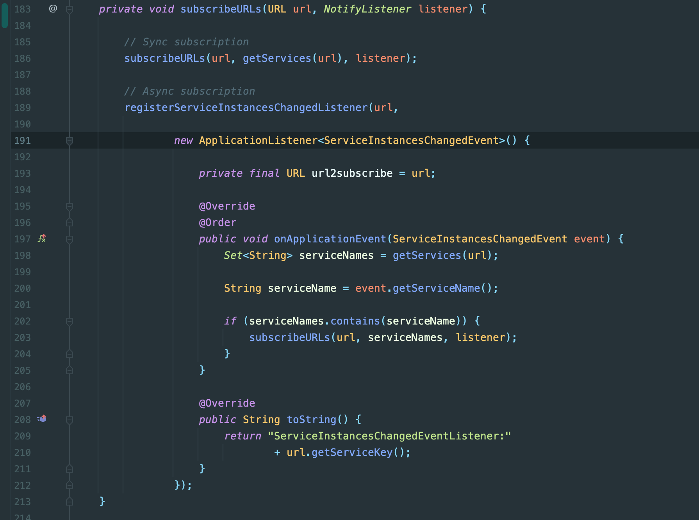
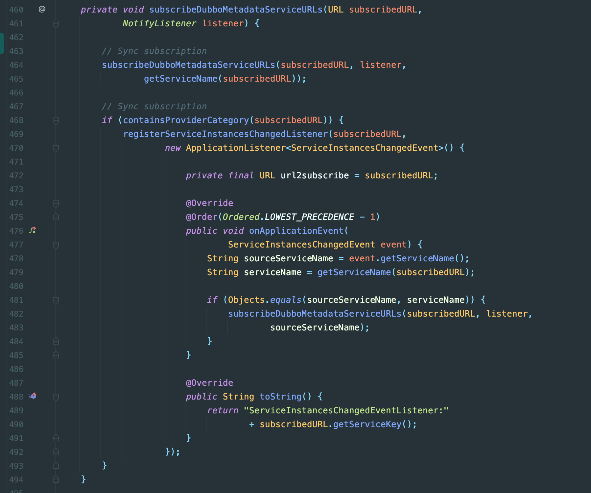
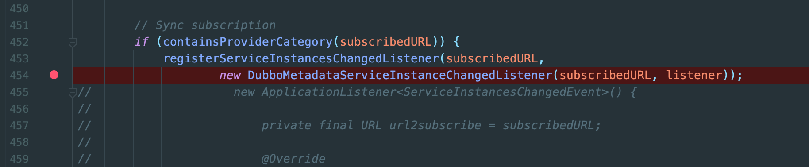
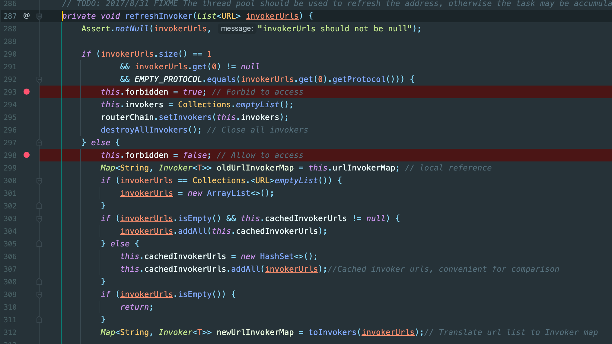
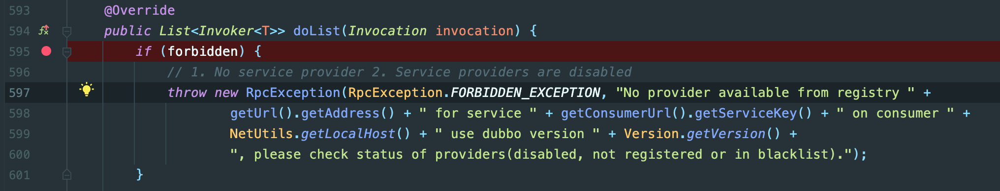
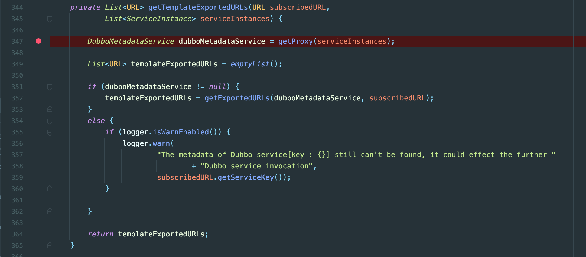

# No provider available from registry localhost:9090 for service xxx/com.alibaba.cloud.dubbo.service.DubboMetadataService:1.0.0 on consumer 172.16.4.30 use dubbo version 2.7.8, please check status of providers(disabled, not registered or in blacklist) .

## 问题描述 Problem Description

重启提供者之后，消费者后端报错，错误信息见标题

After restarting the provider, the consumer backend reports an error, see title for error message

## 问题原因 Cause of the problem 

DubboCloudRegistry 类，第 191 行匿名内部类和第 470 行匿名内部类中，对方法 onApplicationEvent 声明的@Order注解不生效，该注解需要和AOP切面注解一起使用，或者声明在class上

DubboCloudRegistry class, anonymous internal class on line 191 and anonymous internal class on line 470, the @Order annotation declared for the method onApplicationEvent does not take effect; this annotation needs to be used with the AOP cut annotation or declared on the class





## 临时解决方式 Temporary solutions

将 DubboCloudRegistry 类完全复制一份出来，放在自己项目中，并且包名完全一致，将匿名内部类改为内部类，并将@Order声明在class上，注释掉原来的匿名内部类，并使用新建的内部类，整个目的只是为了让@Order生效

Make an exact copy of the DubboCloudRegistry class, put it in your project with the same package name, change the anonymous internal class to an internal class, declare @Order on the class, comment out the original anonymous internal class, and use the new internal class, the whole purpose is just to make @Order take effect

``` java
@Order
public class ServiceInstanceChangedListener implements ApplicationListener<ServiceInstancesChangedEvent> {

    private final URL url2subscribe;

    private final NotifyListener listener;

    public ServiceInstanceChangedListener(URL url2subscribe, NotifyListener listener) {
        this.url2subscribe = url2subscribe;
        this.listener = listener;
    }

    @Override
    @Order
    public void onApplicationEvent(ServiceInstancesChangedEvent event) {
        Set<String> serviceNames = getServices(url2subscribe);

        String serviceName = event.getServiceName();

        if (serviceNames.contains(serviceName)) {
            subscribeURLs(url2subscribe, serviceNames, listener);
        }
    }

    @Override
    public String toString() {
        return "ServiceInstancesChangedEventListener:"
                + url2subscribe.getServiceKey();
    }
}

@Order(Ordered.LOWEST_PRECEDENCE - 1)
public class DubboMetadataServiceInstanceChangedListener implements ApplicationListener<ServiceInstancesChangedEvent> {

    private final URL url2subscribe;

    private final NotifyListener listener;

    public DubboMetadataServiceInstanceChangedListener(URL url2subscribe, NotifyListener listener) {
        this.url2subscribe = url2subscribe;
        this.listener = listener;
    }

    @Override
    public void onApplicationEvent(ServiceInstancesChangedEvent event) {
        String sourceServiceName = event.getServiceName();
        String serviceName = getServiceName(url2subscribe);

        if (Objects.equals(sourceServiceName, serviceName)) {
            subscribeDubboMetadataServiceURLs(url2subscribe, listener,
                    sourceServiceName);
        }
    }

    @Override
    public String toString() {
        return "ServiceInstancesChangedEventListener:"
                + url2subscribe.getServiceKey();
    }
}
```

注释掉原来的实现，该用新建的内部类




之后启动项目就可以解决问题

## 如何复现 How to Reproduce

### 环境 Environment

- jdk: OpenJDK Runtime Environment AdoptOpenJDK (build 11.0.10+9)
- nacos: 1.4.1
- spring boot version: 2.3.9.RELEASE
- spring cloud alibaba bom: com.alibaba.cloud:spring-cloud-alibaba-dependencies:2.2.5.RELEASE
- spring cloud bom: org.springframework.cloud:spring-cloud-dependencies:Hoxton.SR10
- 集群要求 Cluster requirements: 建议集群为单节点模式，这样必然会复现，如果是多节点环境，也能复现，但是比较困难 It is recommended that the cluster be in single-node mode, so it will certainly be reproduced, if it is a multi-node environment, it can also be reproduced, but it will be more difficult

后面的复现均在单节点环境进行，之后会说明为什么多节点难复现

The latter steps are performed in a single-node environment, and later will explain why multiple nodes are difficult to reproduce

建议关闭nacos config，启用nacos config并不影响错误复现，只是日志会略有一点点不同

It is recommended to disable nacos config, enabling nacos config does not affect error recurrence, only the logs will be slightly different

### 步骤 Steps

1. 必须先启动消费者，在消费者启动成功后，再启动提供者 - The consumer must be started first and then the provider after the consumer has been started successfully
2. 在确定消费者收到了nacos发送的服务变更请求，并且可以调用成功提供者的接口后，关闭提供者服务 - After determining that the consumer has received a service change request from nacos and can invoke the successful provider interface, shut down the provider service
3. 在确定消费者收到了nacos发送的服务变更请求后，重启提供者 - Restart the provider after making sure that the consumer has received the service change request from nacos
4. 等待提供者重启成功后，消费者收到nacos发送的服务变更请求后就会出现 no provider 异常 - After waiting for a successful provider restart, the consumer receives a service change request from nacos and then the no provider exception occurs

关键日志 Key Logs

消费者第一次接受到nacos的提供者实例变更请求，提供者第一次启动，消费者初始化metadata信息

The first time a consumer receives a provider instance change request from nacos, the provider starts for the first time, and the consumer initializes the metadata information

``` log
INFO 47555 --- [ncesChangeEvent] a.DubboServiceDiscoveryAutoConfiguration : The event of the service instances[name : xxx , size : 1] change is about to be dispatched
INFO 47555 --- [ncesChangeEvent] c.a.c.d.s.DubboMetadataServiceProxy      : The metadata of Dubbo service[name : xxx] is about to be initialized
```

消费者第二次收到来自nacos的提供者事例变更请求，提供者关闭

The consumer receives a second provider instance change request from nacos and the provider closes

注意收到变更之后出现的 warn 日志，这些日志在消费者第一次启动的时候也会出现

Note the warn logs that appear after a change is received, these logs also appear when the consumer first starts

``` log
INFO 47555 --- [ncesChangeEvent] a.DubboServiceDiscoveryAutoConfiguration : The event of the service instances[name : xxx , size : 0] change is about to be dispatched
WARN 47555 --- [ncesChangeEvent] c.a.c.d.r.DubboCloudRegistry             : There is no instance in service[name : xxx]
WARN 47555 --- [ncesChangeEvent] c.a.c.d.r.DubboCloudRegistry             : There is no instance from service[name : xxx], and then Dubbo Service[key : com.XxxService] will not be available , please make sure the further impact
WARN 47555 --- [ncesChangeEvent] c.a.c.d.r.DubboCloudRegistry             : There is no instance in service[name : xxx]
WARN 47555 --- [ncesChangeEvent] c.a.c.d.r.DubboCloudRegistry             : There is no instance from service[name : xxx], and then Dubbo Service[key : com.XxxService] will not be available , please make sure the further impact

...
```

消费者第三次收到来自nacos的提供者事例变更请求，提供者重启，消费者产生错误日志

The consumer receives a third provider instance change request from nacos, the provider restarts, and the consumer generates an error log

``` log
 INFO 47555 --- [ncesChangeEvent] a.DubboServiceDiscoveryAutoConfiguration : The event of the service instances[name : xxx , size : 1] change is about to be dispatched
ERROR 47555 --- [ncesChangeEvent] .s.DubboMetadataServiceInvocationHandler : No provider available from registry localhost:9090 for service xxx/com.alibaba.cloud.dubbo.service.DubboMetadataService:1.0.0 on consumer 172.16.4.30 use dubbo version 2.7.8, please check status of providers(disabled, not registered or in blacklist).
```

### 原因分析 Cause Analysis

首先看一下最上面的两个匿名内部类的作用 DubboCloudRegistry 类，第 191 行和第 470 行。

First, look at the role of the top two anonymous internal classes DubboCloudRegistry class, line 191 and line 470.

这两个类注册了针对 ServiceInstancesChangedEvent 的 ApplicationListener，第 191 行的匿名内部类是针对项目调用的 dubbo 服务接口，第 470 行的匿名内部类针对的是 DubboMetadataService 接口。两个类作用是当发生 ServiceInstancesChangedEvent 后，检查并更新dubbo接口的状态，关键方法：RegistryDirectory 类中 notify(List<URL> urls) 方法，然后调用到同类中的 refreshInvoker(List<URL> invokerUrls) 方法。该方法中会修改 this.forbidden，如果接口可以调用，则改为 false，否则为 true。如果项目调用dubbo接口，但是forbidden为true，就会报 no provider异常。

These two classes register the ApplicationListener for the ServiceInstancesChangedEvent, the anonymous internal class on line 191 is for the dubbo service interface called by the project, and the anonymous internal class on line 470 is for the DubboMetadataService interface. The key method: the notify(List<URL> urls) method in the RegistryDirectory class, and then the call to the refreshInvoker(List<URL> invokerUrls) method. This method modifies this.forbidden to false if the interface can be called, otherwise true. if the project calls the dubbo interface, but forbidden is true, it will report no provider exception.





这里的关键在于第 191 行的匿名内部类，通过调用的方法一路走下去，可以看到一行关键代码，类 DubboCloudRegistry 中 List<URL> getTemplateExportedURLs(URL subscribedURL, List<ServiceInstance> serviceInstances) 方法中的第一行，即第 347 行。



这里调用的getProxy方法会获取 DubboMetadataService 来做之后的接口校验，问题就出现在这里，在检查dubbo接口状态的时候，必须先检查 DubboMetadataService 是否可用，否则 dubbo 接口的检查会先因为 DubboMetadataService 不可用而报 no provider exception from DubboMetadataService 而不是自己本身的 no provider exception。所以两个匿名内部类在 onApplicationEvent方法上都标注了@Order注解来保证执行顺序，只不过这种方式是不生效的。

The getProxy method called here will get the DubboMetadataService to do the interface verification afterwards, and here's the problem: when checking the state of the dubbo interface, you must first check whether the DubboMetadataService is available, otherwise the dubbo interface check will first report no provider exception from DubboMetadataService because Otherwise, the dubbo interface check will first report a no provider exception from DubboMetadataService instead of its own no provider exception because DubboMetadataService is not available. onApplicationEvent method are marked with the @Order annotation to ensure the order of execution, but this approach is not effective.

但是为什么这个问题会很难复现。

But why is this problem so difficult to reproduce.

经过测试，如果提供者先启动，消费者后启动，消费者第一个注册的 EventListener 就是 DubboMetadataService 的 listener。间接的保证了 listener 的调用顺序，之后无论如何重启提供者，都可以成功恢复服务，这就是为什么要保证消费者先启动。

After testing, if the provider starts first and the consumer starts later, the first EventListener registered by the consumer is the DubboMetadataService listener. indirectly, the order of the listener calls is guaranteed, and the service can be successfully restored afterwards no matter how the provider is restarted. This is why it is important to ensure that the consumer starts first.

多节点模式我并没有做过测试，不过可以按照上述问题原因进行一些简单的猜测。比如说提供者有两个或两个以上的节点，消费者有一个或者多个节点，如果一部分提供者重启，那么消费者的 listener 执行顺序即使不正确，多个 DubboMetadataService 中总是有一个或多个还是可用的，并不会出现问题。如果所有的提供者都挂掉，重启提供者的时候，第一个提供者启动成功，会出现no provider错误，但是第二个提供者启动后，会再次触发接口检查，要注意虽然由于listener调用顺序问题导致出现错误，但是最后一个listener，即 DubboMetadataService 的 listener 是会恢复的。一旦再接受一次 ServiceInstancesChangedEvent，那么所有接口都将恢复正常。情况再特殊一点，比如提供者几乎同时启动，导致消费者只收到了一次 ServiceInstancesChangedEvent，那么仍然会出现 no provider 错误，这也许就是为什么这个错误总是偶尔出现的原因。这也说明这个错误还可以再提供者启动成功后通过手动触发一次 ServiceInstancesChangedEvent 来解决(我没找到解决方式)，但是 error 日志必会产生。

I have not tested the multi-node model, but I can make some simple guesses as to the cause of the above problem. For example, if the provider has two or more nodes and the consumer has one or more nodes, if part of the provider is restarted, then even if the consumer listener is executed in the wrong order, one or more of the multiple DubboMetadataService will always be available and there will be no problem. If all the providers hang, when restarting the providers, the first provider starts successfully and a no provider error occurs, but the second provider starts and triggers the interface check again, so be aware that although the error occurs due to the listener call order, the last listener, the The DubboMetadataService listener will be restored. Once the ServiceInstancesChangedEvent is accepted again, then all interfaces will be restored. In a more unusual case, such as a provider starting almost simultaneously and causing the consumer to receive the ServiceInstancesChangedEvent only once, the no provider error will still occur, which is probably why the error always appears occasionally. This also means that the error can be solved by manually triggering a ServiceInstancesChangedEvent after the provider has started successfully (I didn't find a solution), but the error logs will be generated.


